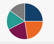

# Content tabs

Sometimes, it's desirable to group alternative content under different tabs,
e.g. when describing how to access an API from different languages or
environments. Material for MkDocs allows for beautiful and functional tabs,
grouping code blocks and other content.


=== "red" 
    This is red stuff. It must be indented by 4 spaces

=== "green" 
    This is green stuff. It too must be indented by 4

=== "blue" 
    This is green stuff. It too must be indented by 4


## Usage

### Basic tabs

Tab names/titles follow a marker like `=== Tab Title`. Always indent the tab content by four spaces.
The three tabs above were created with this markdown
```
=== "red" 
    This is red stuff. It must be indented by 4 spaces

=== "green" 
    This is green stuff. It too must be indented by 4

=== "blue" 
    This is green stuff. It too must be indented by 4
```

### Grouping code blocks

Code blocks are one of the primary targets to be grouped, and can be considered
a special case of content tabs, as tabs with a single code block are always
rendered without horizontal spacing:

``` title="Content tabs with code blocks"
=== "C"

    ``` c
    #include <stdio.h>

    int main(void) {
      printf("Hello world!\n");
      return 0;
    }
    ```

=== "C++"

    ``` c++
    #include <iostream>

    int main(void) {
      std::cout << "Hello world!" << std::endl;
      return 0;
    }
    ```
```

<div class="result" markdown>

=== "C"

    ``` c
    #include <stdio.h>

    int main(void) {
      printf("Hello world!\n");
      return 0;
    }
    ```

=== "C++"

    ``` c++
    #include <iostream>

    int main(void) {
      std::cout << "Hello world!" << std::endl;
      return 0;
    }
    ```

</div>

### Grouping other content

When a content tab contains more than one code block, it is rendered with
horizontal spacing. Vertical spacing is never added, but can be achieved
by nesting tabs in other blocks:

``` title="Content tabs"
=== "Unordered list"

    * Sed sagittis eleifend rutrum
    * Donec vitae suscipit est
    * Nulla tempor lobortis orci

=== "Ordered list"

    1. Sed sagittis eleifend rutrum
    2. Donec vitae suscipit est
    3. Nulla tempor lobortis orci
```

<div class="result" markdown>

=== "Unordered list"

    * Sed sagittis eleifend rutrum
    * Donec vitae suscipit est
    * Nulla tempor lobortis orci

=== "Ordered list"

    1. Sed sagittis eleifend rutrum
    2. Donec vitae suscipit est
    3. Nulla tempor lobortis orci

=== "Equation"

     $\begin{align}
     2x	+	y	−	2z  &=	3   \\\
     x	−	y	−	z    &=	0   \\\
     x	+	y	+	3z   &=	12
     \end{align}$

=== "Image"

     


</div>

### Embedded content

Content tabs can contain arbitrary nested content, including further content tabs,
 and can be nested in other blocks like [admonitions] or blockquotes:

``` title="Content tabs in an admonition block"
!!! example

    === "Unordered List"

        ``` markdown
        * Sed sagittis eleifend rutrum
        * Donec vitae suscipit est
        * Nulla tempor lobortis orci
        ```

    === "Ordered List"

        ``` markdown
        1. Sed sagittis eleifend rutrum
        2. Donec vitae suscipit est
        3. Nulla tempor lobortis orci
        ```
```

<div class="result" markdown>

!!! example

    === "Unordered List"

        ``` markdown
        * Sed sagittis eleifend rutrum
        * Donec vitae suscipit est
        * Nulla tempor lobortis orci
        ```

    === "Ordered List"

        ``` markdown
        1. Sed sagittis eleifend rutrum
        2. Donec vitae suscipit est
        3. Nulla tempor lobortis orci
        ```

</div>

