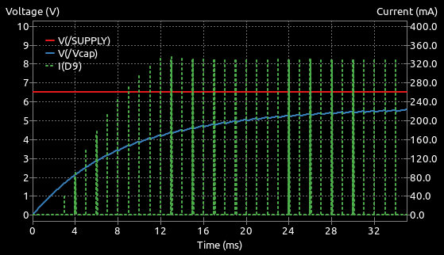

# Basic Constant Current Drive for Sensor Emitters

## Conventional drive

In the section on [switched emitter driving](./switched-emitter-drive.md), one of the simplest working options looked like this:

/// caption
Basic Bipolar Switched Emitter
///

This configuration, with an IR LED, would work well in a typical classic micromouse with a 5 Volt supply voltage. However, in a half-size mouse there may not be a 5 Volts supply and so the available headroom for the LED supply becomes marginal. So marginal that the use of a visible light LED like the TLCR5800 is probably not possible at more than a fairly low current.

It is likely tempting to connect the LED supply directly to the battery to get a somewhat higher voltage. but that causes another issue. As the robot runs around, the battery voltage will constantly change and with it, the LED output. If the LED output varies, so will the detector reading, regardless of the walls. 

What is needed is a way to keep the current through the LED constant even if the supply voltage changes.

## Constant current
There are many ways to create a constant current drive. Ideally, the current would be completely independent of VDD but, of course there will be some lower limit below which there will not be enough headroom to fully accommodate the forward voltage drop of the LEDs. These circuits vary in their complexity and effectiveness. With space at a premium, builders want a simple solution wherever possible.

## Simple Solution
The resistor R8 in the previous circuit limits the current that can flow through the LEDs. It has no other purpose. Suppose, however, we place the current limit resistor on the emitter of the drive transistor instead of between the collector and the LED. 

/// caption
Simplest Current Regulation
///

There are the same number of components and they have the same values (Q5 is a BC337-40) but now the circuit behaviour is very different.

As current flows through the LEDs, the voltage at the emitter of Q5 will rise. If it rises enough so that it is within 0.7 Volts or so of the base, the transistor will begin to turn off and the current will reduce. There is, then, negative feedback in the circuit and the current is now controlled only by the emitter resistor, not the supply voltage. 

In this example, suppose the GPIO output is 3.3 Volts. If the emitter of Q5 gets to about 2.6 Volts, the circuit should start to be stable. That corresponds to a current of around 2.6/6.8 = 382mA. In practice, some current will flow from GPIO, through the resistor R8 and out of the emitter. Not much current - less than 1 mA depending on the gain of the transistor. So the total emitter current will include the base current and the collector current will be a little less. Not by much though - less than 2% typically.

The high current requirement, if it can be achieved, will need somewhat more than the typical, rule-of-thumb - value 0.7 Volts for $V_{BE}$. Probably more like 0.8V so the voltage across R8 will be around 2.5 Volts and the actual emitter current will be $2.5/6.8 = 360mA$. Combined with the base current and other transistor effects, the actual current achievable through the LED will be a little lower still.

So what? Well, notice that none of this reasoning has any mention of the supply Voltage. So long as there is enough supply voltage to provide the forward voltage drop of the LEDS, the voltage across the emitter resistor and a volt or so for linear transistor operation, the current should be constant and independent of the supply voltage. Here, anything above about 6.5 Volts will be enough to ensure correct circuit behaviour. That is a convenient number because it is around the voltage that corresponds to a pair of depleted LiPo cells.

In summary, leaving at least one volt to ensure the transistor can operate in its linear mode:

$$
V_{cap} > V_{LED} + I . R_E + V_{CE(sat)} + 1 Volt
$$

The extra 1 Volt ensures linear operation. Remember that the resistor R11 reduces the average voltage value on the capacitor depending on the pulse duty cycle so $V_{cap}$ is always somewhat less than $V_{supply}$.

It should be clear that an attempt to increase the current by reducing the value of the emitter resistor will increase the voltage drop across the LEDs, reducing the available headroom. Even so, it should be possible to get more than 250mA through the LEDs with a 6.5 Volt supply and good pulse shapes. You can double that if you increase the value of the storage capacitor and are happy to accept a pulse that begins to decay rapidly.

Note that, because the transistor is operating in its linear region, it will dissipate a little more power than when operated as a switch. With the example parameters - 328mA for 25us out of every 1000us - the average power dissipation would be around 6mW. Even if the emitter gets stuck on, the protection resistor, R11 keeps everything safely limited.

## Simulating the Circuit

Running this circuit through the simulator shows that the voltage on the capacitor, $V_{cap}$ still takes just as long to get to a stable value but the LED current pulses stabilise well before that.

 
 /// caption
 Basic Bipolar Regulation
 ///

The pulses stabilise as soon as the capacitor voltage is high enough to provide adequate regulation by the transistor. As little as 4.5 Volts on the capacitor is enough and, at all voltages above that, the pulse shape is the same. Here is one of the stable pulses.

/// caption
Single 328mA pulse from Basic Regulator
///

It is clear that there is no droop and the current pulse is nice and constant. The current rises to the same value as in the switched case but is now sustained throughout the pulse as the transistor compensates for any droop in the capacitor voltage.

## Testing Compliance

Compliance is the ability of the circuit to provide a consistent current for a range of input voltages. The power-up data shown above imply that, as long as the supply voltage is greater than 4.5 Volts, regulation will be good. Just to illustrate the point, the simulation can be run again with the supply voltage set to 8.4 Volts, corresponding to a freshly charged 2S LiPo battery.

 
 /// caption
 Basic Regulation With Higher Supply Voltage
 ///

Exactly as before, the pulses stabilise quickly at the same level and remain unaffected by the supply voltage.

## Sources of error

This is **not** a *precision* current source. While it can compensate very well for variations in supply voltage, it is subject to some change in the $V_{BE}$ behaviour with temperature and it will be affected by the actual voltage available from the GPIO pin.

In fact, the LED current is proportional to the GPIO voltage. If, for example, the GPIO voltage is only 3 Volts, the voltage across R8 will be correspondingly lower and the LED current will be reduced. 

However, during normal operation of the processor you can be quite confident that the GPIO voltage will be stable enough for the purposes of this circuit. If it does change, that would be a sign that there may be some other problem in the rest of the robot circuits.

Also, remember that the calculations will refer to typical devices and individual parts are subject to the normal tolerances.

There are some modest sources of error or inaccuracy but overall, for its intended purpose, this circuit is a great improvement over a simple switched emitter. It makes for a simple solution to getting consistent and stable current pulses even with the use of unregulated supplies. In a micromouse robot, where the walls themselves can vary in reflectivity by several percent, it probably needs little or no improvement.

When choosing a transistor for Q5, several types will do the job. Aim for something that can pass several hundred milliamps while still having a current gain of at least 100. The BC337-40 has proven reliable and is cheap and commonplace.

## Other LED types

All the calculations so far have been for  an IR LED like the SFH4550. If you wanted to use a high intensity visible type like TLCR5800, the only change will be the minimum supply voltage needed  ensure correct operation at the intended current. With the current still at 328mA, the TLCR5800 will need around 5.75 Volts on the capacitor before the pulses stabilise. That is still, just, possible with a supply voltage of 6.5 Volts but no less. That 6.5 Volts is the lowest that you should allow a 2S LiPo battery to operate at - certainly for more than a few seconds.

Recall that most use cases in micromouse robots do not require LED currents to be that high unless your detector is a photodiode and you need to reduce the load resistance to better match the ADC input.

## Possible Improvements

Now that the LED current pulses are better regulated, it might be worth revisiting the reservoir capacitor calculation. Large value Tantalum capacitors are expensive and take up space so you might consider reducing the value. In this circuit, and still using 328mA pulses through a SFH4550 LED, the capacitor C3 can be reduced to as little as 10uF and still give good current pulses. The ripple on the $V_{cap}$ voltage will be much greater and the circuit should still operate at the lower limit of the intended supply range. Because the transistor is regulating the current through the LED, the actual value if $V_{cap}$ is less critical. With a visible light LED, the pulses will begin to droop fairly quickly. As already mentioned, consider reducing the current to manage that.

Take care though before using MLCC capacitors instead of Tantalums. Typical MLCC capacitors do not give anywhere near their rated capacitance once they have a few volts of DC bias across them. Also, the smaller the package, the worse the effect. This is not the place to go into detail but, if you *must* use MLCC types, make them at least four times larger than you calculate and avoid small packages like 0603 or 0402.

## Other Current Regulators

If you feel the need for more reliable or accurate solutions, have a look atthe [Improved Current Regulation]() page.

