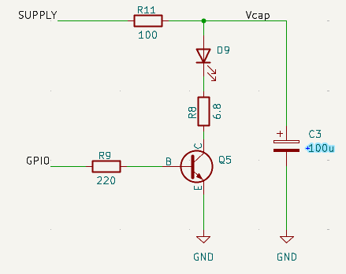
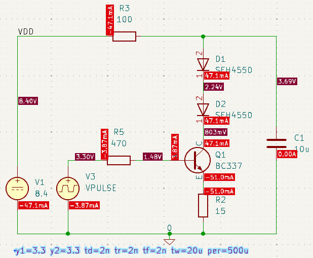
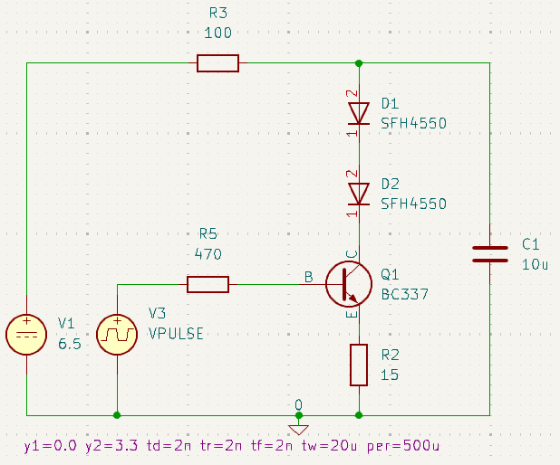

# Basic Constant Current Drive for Sensor Emitters

## Conventional drive
Normally, the micromouse sensors might use an arrangement like this, assuming we want to drive two LEDs at the same current from some supply voltage VDD

This might be the kind of configuration you would use in a half-size mouse with two LiPo cells. The LED current is probably a bit low for a classi mouse.

It should be clear that the actual current that will flow through the LEDs will depend upon the voltage at VDD. The storage capacitor can only charge to that voltage so output will vary with VDD. Designers will use a regulated supply for VDD to ensure it remains constant as the battery Voltage decays during a run. It is not uncommon to use a MOSFET or darlington device in place of Q2 so that the deviceacts as a simple switch always completely on or completely off.

### Constant current
There are many ways to create a constant current drive so that the current through the LEDs is less dependent upon the value of VDD. Ideally, the current would be independent of VDD but, of course there will be some lower limit below which there will not be enough headroom to fully accommodate the forward voltage drop  of the LEDs. These circuits vary in their complexity and effectiveness. With space at a premium, builders want a simple solution wherever possible.

## Simple Solution
The resistor R7 in the previous circuit limits the current that can flow through the LEDs. It has no other purpose. Suppose, however, we place the current limit resistor on the emitter of the drive transistor. 

There are the same number of components and they have the same values but now the circuit behaviour is very different.

As current flows through the LEDs, the voltage at the emitter of Q3 will rise. If it rises enough so that it is within 0.7 Volts or so of the base, the transistor will begin to turn off and the current will reduce. There is, then, negative feedback in the circuit and the current is now controlled only by the emitter resistor, not the supply voltage. 

In this example, suppose the GPIO output is 3.3 Volts. If the emitter of Q3 gets to about 2.6 Volts, the circuit should start to be stable. That corresponds to a current of around 173mA. In practice, some current will flow from GPIO, through the resistor R8 and out f the emitter. Not much current - less than 1 mA depending on the gain of the transistor. That means the base voltage would be more like 2.9 Volts because of the drop across R8 and the emitter would stabilise at about 2.2 Volts. The current through R10 would now be closer to 147 mA. Nearly all of that will have come from the collector of the transistor which means it must have flowed through the LEDs.

So what? Well, notice that none of this reasoning has any mention of the supply Voltage. So long as there is enough supply voltage to provide the forward voltage drop of the LEDS, the voltage across the emitter resistor and a volt or so for linear transistor operation, the current will be constant.and independent of the supply voltage. Here, anything above about 6.5 Volts will be enough to ensure correct circuit behaviour. That is a convenient number because it is around the voltage that corresponds to a pair of depleted LiPo cells.

It should be clear that an attempt to increase the current by reducing the value of the emitter resistor will increase the voltage drop across the LEDs, reducing the available headroom. Even so, it should be possible to get more than 250mA through the LEDs with a 6.5 Volt supply and good pulse shapes. You can double that if you increase the value of the storage capacitor and are happy to accept a pulse that begins to decay rapidly.

## Simulating the Circuit
This circuit shows a more complete version for simulation:

 

- A voltage source driving the base to simulate a GPIO pin left high.
- Two LEDs are run in series.
- Overall current is limited by the 100$\Omega$ resistor in the supply line. 
- Operating current for the emitter pulses will come from the storage capacitor C1.

## Fault behaviour
In this state, we can perform an operating point analysis of the worst case current through the LEDs in case of a fault with a freshly charged battery and  the IO pin stuck high. I have reduced the base resistor to allow more current to flow into the transistor in case it has a low gain.

- The transistor will be hard on and saturated
- The current through the LEDs will be limited to about 47mA. This is a safe level that will not damage the LEDs though it is probably still not eye-safe for IR LEDs.
- The transistor emitter will be at about 0.76 Volts
- $V_{BE}$ is 0.715 Volts
- The current limit resistor, R3, is dropping 4.7 Volts
- The GPIO port will need to output 3.9mA. This is well within the capabilities of the port.
- The SFH4550 LEDs can tolerate 100mA continuous current flow. at which point their individual forward voltage is about 1.5 Volts. R3 could be reduced to perhaps 47 Ohms and stilll maintain safe operation 

The simulator output is a little hard to follow because it places so many labels. 

## Dynamic operation
Normal operation is for the emitter to be pulsed on for a short period on every control cycle. Suppose we want a 30us pulse 2000 times per second. This is rather more than is normal but we want to design for the more demanding cases. Restoring the proper pulse activity of the IO pin, and setting the battery to a depleted level of only 6.5 Volts, gets us this circuit:

Let's have a look at a few of pulses emitted after the circuit has been operating for a few milliseconds - which is all it takes to reach steady state.

We get clean, regular pulses with a peak currrent of 157mA through both LEDs.

Now see the difference when the supply voltage is 8.4 Volts from a fresh battery

The current pulses are identical. The LEDs will be the same brightness across the range of voltages available from the battery.

The magnitude of the emitter pulse current will be affected by the transistor gain but transistors shoudl in any case be chosen for a narrow range of gains. In this example, you might selct a BC337-40 rather than any old BC337 from the parts bit so that the gain is between 250 and 630 (according to the data sheet) rather than the full available range of 100 to 630. For that more narrow range of transistor gains, you might expect the emitter current to range from 148mA to 160mA from one transistor to another.

Peak current into the base might be a few milliAmps for the very short time needed to charge any base capacitance but will typically be a few hundred microAmps during the pulse.

## Other sources of error
The entire scheme depends upon the GPIO output voltage being stable with a known value. The LED current is proportional to the GPIO voltage. That is, a 5% reduction in that voltage will cause about a  5% reduction in the LED current. Certainly, the load on the port will pull the voltage down a little. The assumption is that, with the entire system working in its steady state, any deviation of the GPIO voltage from its nominal 3.3 Volts will remain pretty steady since the processor supply is itself stabilised.
