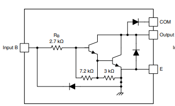
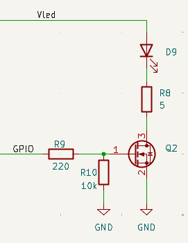
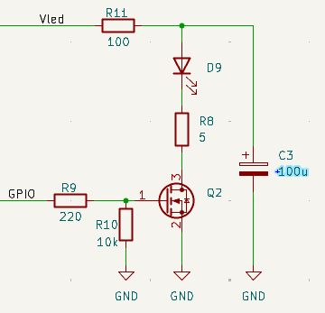
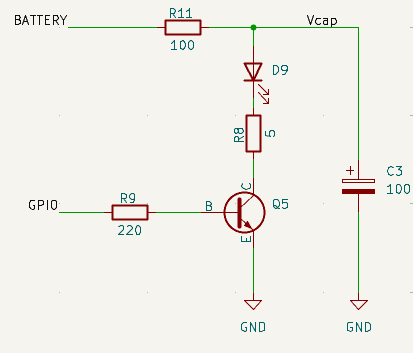
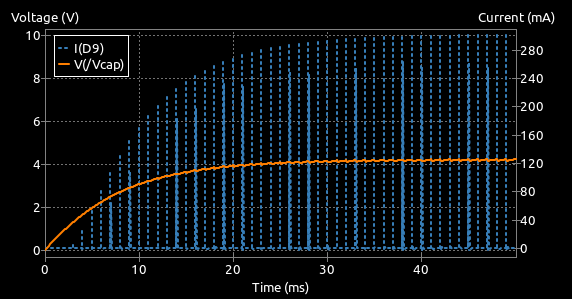
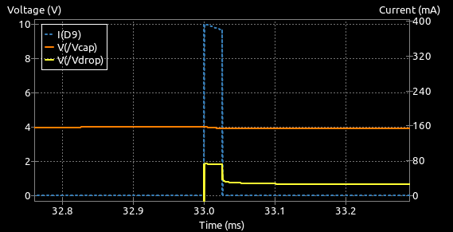
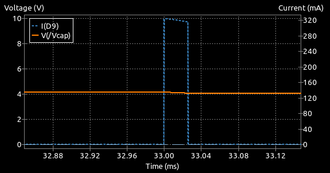

# Switched Emitter Driving

The fundamental task of the wall sensor emitters is to shine light on the walls so that it can be detected by some other device. It is nether practical, nor desirable to just turn on a LED and leave it on. Not only is the available light output not likely to be sufficient when the LED is operating safely within its limits, the light from each LED will also illuminate detectors other than the one for which it is intended.

A better solution is to turn on each LED in turn for a brief period and measure the light reflected from just that LED. This brings a few benefits:

 - Reduced interference from the other sensors
 - Extra bright pulses of light for lower average current
 - Cancellation of ambient illumination.

### Reduced Interference

It should be fairly clear that, by only lighting up one LED at a time, you can be sure that other detectors are not going to see light reflected from unexpected places. For example, the front sensors will easily detect light from side walls if the side emitters are illuminated. This effect gets worse as the mouse approaches a dead end and light from the side sensors can get reflected off the side walls onto  a wall ahead where is can easily be picked up by the front detectors.

It may be safe to light up the two side sensors together, or the two front sensors together but certainly not a side and front sensor on the same side. For best reliability, light each sensor individually.

Depending on your detector circuit and software configuration, it can be possible that the signal of one sensor is affected by the signal from the previous sensor. This should be rare but it is worth experimenting with the order in which the sensors are read and the interval between readings if you suspect that one sensor is interfering with another.

### Extra Bright Illumination

In normal, continuous illumination a sensor LED might only be able to handle a relatively low current without overheating. For the SFH4550 IR LED, for example, that limit is only about 100mA. However, the same device is able to handle currents as high as 1 Amp (10x bigger) for short periods up to about 100us. The light output is proportional to current so you can create very bright pulses of light but only for a short time. The detector and processor typically only need a few tens of microseconds at most to capture the resulting reflection. 

Pulsing the light like this reduces the average amount of current needed for each LED. If you were to turn each one on for just 25us out of every 1000us and provide a 250mA current pulse, the average current draw would be only 6mA and yet you are getting light pulses that are 2.5 times as bright as would be available for a continuous 100mA illumination. The saving is huge - especially for half-size robots where the batteries are necessarily much smaller. Note that the duty cycle - that is, the proportion of time that the LED is lit - should be kept low so that the average current is not exceeded.

### Cancellation of Ambient Illumination

It is all well and good to turn on the emitter LED and then measure the amount of light reflected by the walls. However, some of that light comes from the other sources of illumination in the area - the ambient illumination. By making only one measurement, it is not possible to work out anything about the ambient light levels. Remember, if you are using IR sensors, you are unable to see any of that anyway so you cannot make a judgement about it either.

The usual method for handling this is to read the detectors twice. First, take a reading with the LED off. This is the ambient light level. Then, turn on the LED, wait a few microseconds to make sure everything is stable and then take another reading. This reading, coming very soon after the ambient reading, should have the same ambient component plus whatever is purely the result of any nearby objects reflecting the LED light. Thus any changes in the ambient level, that happen relatively slowly, will be cancelled out. Note that modern LED lighting may not contain much of an IR component but may be flashing quite rapidly - perhaps hundreds of times per second.

Now you can just subtract the ambient reading from the 'lit' reading to get the raw, reflected intensity reading:

$$ I_{RAW} = I_{LIT} - I_{AMB} $$

---

## Switching Options

It seems unlikely that you would want to use anything mechanical so the usual choice is between different types of transistor. There are dedicated LED driver ICs but these don't always cater for the specific needs of micromouse robots. The choice then is probably limited to one of these transistor types:

- Single bipolar transistor
- Darlington bipolar transistor
- MOSFET transistor

### Single Bipolar Transistor

This is one of the simplest choices. All you need is a suitable bipolar transistor and a couple of resistors to build your circuit:

/// caption
A simple transistor switch
///

The circuit has some fairly arbitrary values so that's take them in turn and look at how to choose your own values.

#### The LED

Arguably the most important component. You may choose Infra Red (IR) or visible light devices. Aside from any optical properties, all LEDs will result in a forward voltage drop when current flows through them. For a typical IR LED - the SFH4550 - this will be about 2.0 Volts at 500mA, rising to 2.5 Volts at 1 Amp. This voltage will need to be taken into account when caclulating the current limit resistor R8.

For a visible light LED like the TLCR5800, that voltage drop can be much higher and might approach 3.5 Volts at 500mA, rising to 4.7 Volts at 1 Amp.

#### Current Limit Resistor R8

This resistor is used to limit the current that can flow through the LED. If the current is too high, or allowed to flow for too long, the LED can be damaged or destroyed. There is a power supply, $V_{LED}$, that can provide the current needed. Assume for a moment that the transistor, Q2, can be turned fully on and the voltage between collector and emitter, $V_{CE}$, is 0.2 Volts. It may be a little higher or lower, depending on the actual transistor type and the current we want through the LED.

The LED and the transistor then may account for about 2.5 Volts and we should be able to have $V_{LED}$ as low as 3.3 Volts and still get the circuit to operate.

Suppose $V_{LED}$ is 3.3 Volts. There is $3.3 - 2.5 = 0.8 Volts$ across R8 and, if we want 500mA to flow, R8 must have the value $0.8/0.5 = 1.6\Omega$

That all seems well and good so long as the 3.3 Volt supply can provide the required current. It should be clear that, if the supply were 5 Volts, the value of R8 should increase to $(5.0 - 2.5) = 2.5/0.5 = 5\Omega$ 

For many micromouse designs, 250mA through an IR LED is sufficient and, with a 3.3 Volt supply, R8 could be 5.6 Ohms. For others, the goal might be nearer 1 Amp.

But, what if the design required  a visible light LED like the TLCR5800. Now the forward voltage drop of the LED exceeds the available voltage from a 3.3 Volt supply and only a 5.0 Volt supply will do.

#### The Transistor, Q2

It is always possible to go exotic with transistor choices but simple is often better. Here the BC337-40 has been chosen because it is cheap, easy to find and has characteristics that are adequate for most use cases. This transistor has a current gain of about 100 even at the kinds of collector current we have considered. For safety though, consider the current gain to be just 50 and the maximum collector current we need to be just 500mA. That means the base will need $500/50 = 10mA$ which is well within he capabilities of most microprocessor IO pins. 

#### The base resistor, R9
To the processor, the base will just look like a diode connected to ground. Suppose the processor IO pin high voltage is 3.3 Volts. To limit the current from the processor to the 10mA we need, the base resistor, R9, should be chosen to be $(3.3 - 0.7)/0.01 = 260\Omega$.  The circuit has a value of 220 Ohms for a bit of extra margin.

If the LED current required is substantially higher, the base current will need to be higher as well. Do not reduce the base resistor any more than needed to get the required transistor base current. You microcontroller will not play well with large current demands from its IO pins. Processor pins are commonly limited to values less than 20mA per pin.

If you are expecting higher output currents from the IO pins, check to see if your processor of choice has settings that limit the amount of drive available. The STM32 series do this as a power saving option so make sure sufficient drive is available.

--- 

So there we have it - a simple, low component count LED emitter drive. What more could we need?

### Darlington Transistor Pair

One possible concern with the basic transistor circuit is the current needed from the processor's GPIO pin to guarantee driving the transistor into saturation. That is, making sure it acts as a switch. 

To try and address this issue, some builders have used a driver chip that contains a number of Darlington pair transistors. A fairly common choice used to be something like the ULN2003 - a seven channel Darlington  transistor array. Internally, each channel looks like this:

/// caption
Using a Darlington Transistor Array
///

A pair of transistors are connected together in such a way as to greatly increase the current gain. the other components ensure that the output transistor is turned hard on with an input voltage of at least 3.0 Volts. Perfect for modern processors with output voltages of 3.3 Volts. These chips were originally intended to drive things like stepper motors and relays so they include additional protection circuitry that does not really concern us here.

While convenient in many ways, the ULN2003 does have some limitations. 

First, they are only rated for a peak maximum current of 500mA per channel. If you feel a need for more, you can connect channels in parallel. The device as a whole can handle up to 2.5 Amps in total.

Second, when fully turned on, the voltage drop between the output and ground may be as high as 1.6 Volts according to the data sheet. When you add that to the 2.1 - 2.3 Volts dropped by an IR LED, it is clear that these devices are only really useful in systems that can provide a 5 Volt supply. You still need to calculate an appropriate current limit resistor value though you no longer need to worry about the base resistor since only about 1mA is needed to fully turn on the output. With a high-brightness visible light LED like the TLCR5800, even operation at 5 Volts maybe difficult with very high currents.

If you have a 5 Volt rail and fancy the convenience of a single IC, this may be the device for you.

### MOSFET Driving Transistor

For switching circuits like these it is rather more common to find an N-channel MOSFET used in place of the bipolar device in the first circuit. Compared to bipolar transistors, MOSFETs often provide lower losses, need almost no  drive current and can switch faster.

/// caption
Using a MOSFET
///

MOSFETs can bring distinct advantages in this application. Driving the gate of a MOSFET consumes almost no current so the load on the processor's GPIO pin is negligible. There is still a small resistor between the IO pin and the gate though. This is needed to limit the brief current spike when the MOSFET is initially turned on. A few hundred ohms is sufficient. More than that will slightly slow down the current pulse rise time.

You will also see an additional resistor of 10kOhm from the gate to ground. This is a safety precaution to ensure reliable operation of the device. During processor startup following a reset, or in the case of a poorly configured output pin, the gate may be left floating. That is, it might have no connection to any other part of the circuit. In that state, because it takes only very tiny gate currents to operate a MOSFET, you may find the device being turned on by stray signals. For example, simply touching the board may provide enough current to turn on the LED. The resistor between gate and ground, R10, ensures that the transistor is always turned off unless the processor explicitly turns it on.

Selection of a suitable MOSFET is not terribly simple. Common parts for through-hole use may need surprisingly high voltages between the gate and ground ($V_{gs}$) before they fully turn on. Even then they may not be able to pass the design current. Parts like the ZVN4306A are useful only if your processor can provide 5 Volts on its output pins. 

Many surface mount parts, like the DMG3202U, are much better suited to the task and can easily pass 1 Amp with only 3 Volts at the gate .

#### Calculating Current with R8

Just like the bipolar version, the amount of current through the LED will depend upon the supply voltage, $V_{LED}$ and the value of the resistor R8. The better MOSFETs, like DMG3202U, have on-state resistances ($R_{DS(ON)}$) of only a few tens of milliOhms and so they can be ignored for this purpose. Even with a current of 1 Amp, the MOSFET might only have a voltage drop of around 20 milliVolts. It is only necessary to consider the LED forward voltage drop. For example, with a supply voltage of 3.3 Volts an IR LED like SFH4550 could operate at 500 mA with a value for R8 of

$$
R8 = \frac{3.3 - 2.0}{0.5} = 2.6\Omega
$$

### Choosing a MOSFET

This is a simple switching circuit. When searching for a suitable MOSFET, you should look for **logic-level** devices. That is, devices designed to turn fully on with only about 3 Volts at the gate. Always check. Do not be misled by a low threshold voltage ($V_{GS(th)}$). This is just the gate-source voltage at which the MOSFET only just starts to conduct and will typically be quite small.

## Circuit Safety

Earlier it was stated that the maximum safe continuous current through an LED might only be about 50 - 100 mA. Suppose an error in the code left the transistor switch permanently on. With the circuits seen so far, the current might be as high as 500mA or 1 Amp. 

Not for very long though as the LED would probably be destroyed quite quickly. Even if it it were not destroyed, it may be damaged such that future operation is affected. Typically the light output would be greatly reduced. With an IR LED especially, it would be hard to detect such a fault.

A simple modification to the circuit can provide protection in such a case while also reducing the demand on the power supply during the large current pulses. 

To limit the possible current to some safe value, a series resistor, here it is R11, can be placed in series with the LED supply voltage. Clearly, this would also limit the current during the illumination time so a reservoir capacitor, C3, is added in parallel with the LED, its current limit resistor and the transistor, to provide the main illuminating current.

/// caption
Protecting the LED
///

The addition of these components will change the other calculations a little. First, though, the value of R11 should be set to a value that will guarantee no harm to the LED should the transistor be turned fully on. In this circuit, if we assume a 5 Volt supply, it is simplest to ignore the other components as having a small effect and just consider the LED connected in series with the protection resistor. At its maximum safe current of 50mA, the SFH4550 would drop about 1.5 Volts. Therefore we need R11 to drop 3.5 Volts at 50mA. A resistor of 70 Ohms would do the trick and for a bit of extra margin, a 100 Ohm resistor has been selected.

During the illumination pulse, almost all of the current through the LED will be provided by the capacitor. Between pulses, the capacitor recharges through R11. Because almost all the current for the LED comes from the capacitor, there will be a substantial reduction in noise on the power supply lines.

This also means that  the reservoir capacitor should have a low Equivalent Series Resistance (ESR). For this purpose, Tantalum capacitors are recommended though they are more expensive. For through-hole parts, aluminium electrolytics will be sufficient.

Note that it is unlikely to charge all the way up to the supply voltage because the charge is constantly being depleted. In fact, the average voltage across the capacitor is easy enough to calculate. Assume the current during each pulse is 500mA, that the pulses are 25us long and are repeated every 1000us. Now the average current is going to be 500mA * 25/1000 = 12.5mA. That average current will flow through R11 which will cause a voltage drop of 100 Ohms * 12.5 mA = 1.25 Volts. Thus, the capacitor can only charge up to the supply voltage less 1.25 Volts.

If there is only a 3.3 Volt supply available this is a problem because you have now lost 1.25 Volts to the protection resistor, R11, and the SFH4550 LED will need more than 2 Volts when it is illuminated. there is nothing left for the current limit resistor, R8, to provide any regulation. With a visible light LED like TLCR5800, with its greater forward voltage, the situation would be worse and there would be no chance of correct operation unless the power supply was at least 5 Volts.

The size of the capacitor will determine the ability of the LED to maintain a constant output during the illumination pulse. If the capacitor is too small, its charge will be depleted quickly causing the LED current, and so its light output, to rapidly drop. Choosing a larger capacitor will ensure that there is sufficient charge for even high current pulses though it will take a little longer for the circuit to reach some kind of equilibrium after the sensors are powered up.  This is because the capacitor must be charged through R11 from the power supply. This would normally only happen after the entire robot is powered on and should be complete within a few hundred milliseconds at most.

In this circuit, as current is supplied by the capacitor, the voltage across it will inevitably drop. It is possible to calculate the capacitance required if you make assumptions about the permitted voltage drop. A longer pulse length or a higher current will cause a greater voltage drop. That in turn will cause a reduction in current. If you do not have much of a voltage overhead in the system then the current drop may become significant.

For now, assume the same 500mA pulse, operating over 25us and that you can manage with a 0.25 Volt droop in the capacitor voltage.

Rearrange the basic capacitor equation:

$$
I = C\frac{\Delta V}{\Delta t}
$$

to give 

$$ 
C = \frac{I . \Delta t}{\Delta V}
 = \frac {0.5 * 0.000025}{0.25}
 = 50 \mu F
 $$

So you might pick a standard value like 100$\mu$F to be on the safe side.

## Pulsed Bipolar Drive Example

Consider now a switched emitter drive using a single bipolar transistor using some of the design decisions already discussed, using a 100 Ohm safety resistor, R11, a 100uF reservoir capacitor C3, and BC337-40 transistor:

/// caption
Pulsed Bipolar Drive
///

Goals:

- LED: SFH4550
- Pulse duration: 25us
- Pulse repetition: 1000us
- Pulse current: 300 mA
- Supply Voltage: 5 Volts
- GPIO output: 3.3 Volts

### Average current:
Assuming we can get a solid 300mA through the LED for the duration of the pulse, the average current through the LED will be 300mA * 25us/1000us = 7.5mA

### Average voltage on the storage capacitor
If the average current through R11 is 7.5mA, we can expect the average voltage drop across it to be 7.5mA * 100 Ohm = 0.75 Volts. Therefore, the capacitor average voltage is $V_{cap}$ = 5.0 - 0.75 = 4.25 Volts

### Settling time for $V_{cap}$ after power up
The time constant for the capacitor voltage is R*C = $100 * 100 * 10^{-6}$ = 10ms. It will take around 3 time constants to get close (95%) to the steady state so the circuit should be operating normally 30ms or so after power on.

A SPICE simulation in KiCAD confirms the calculation

/// caption
Pulsed Bipolar Power On Behaviour
///
    
#### Pulse current

The design called for 300mA pulses of 25us duration. It looks like they are OK but zooming in on just one pulse reveals that the current is a bit high and that it quickly droops a little. The droop is just the capacitor discharging slightly during the pulse.

/// caption
Pulsed Bipolar - Single Pulse
///

Since the droop is quite modest, let's pretend it is flat and recalculate the value of the current limit resistor, R8. The data sheet for the SFH4550 indicates that the forward voltage should be about 1.75 Volts at 300mA. The transistor is saturated and will have a voltage of about 0.2 Volts at the collector. The capacitor voltage has already been calculated at 4.25 Volts. Now, at 300mA, R8 must drop 4.25 - 0.2 - 1.75 = 2.3 Volts and so its resistance will be 2.3/0.3 = 7.66 Ohms. Choose a close standard value.  Make that 6.8 Ohms to try and meet, or slightly exceed, the required current. There is little point in being over-precise since there will be some variation in the characteristics of all the components. The aim is to get close enough. Besides, the values in this circuit interact. Changing R8 alters the current which changes the LED voltage drop, which changes the voltage across R8 and so on.

After changing R8 to 6.8 Ohms, the pulse looks like this:

/// caption
Pulsed Bipolar - Corrected Single Pulse
///

Which is pretty acceptable. The peak is close to the target, the droop is small and the shape is stable.

### Limitations

These calculations provide a perfectly acceptable current pulse through the LED for the conditions set out. However, consider how the circuit would behave if the supply voltage were only 3.3 Volts. The circuit can no longer operate correctly because it is not possible to push 300mA through the LED with such a low supply voltage. In fact, the best that can be managed is pulses of around 160mA. Even if the capacitor voltage got up to 3.3 Volts, the LED and transistor would need nearly 2 Volts, leaving only 1.3 Volts across R8 for a maximum of 1.3/6.8 = 190mA. The pulses settle out a little lower because the average current through the protection resistor, R11, will also act to reduce the capacitor voltage as before.

This is a major limitation of the simple switched drive. The actual current as well as the available current is strongly dependent upon having a stable supply voltage that is high enough to exceed all the fixed voltage drops.

Furthermore, increasing the current will increase the voltage drop across the LED and so even more headroom is needed from the supply. Worse still, if the SFH4550 is swapped out for something like the TLCR5800, the LED voltage drop may be so large that a 5 Volt supply is no longer adequate for any kind of high current use.

Changing from a bipolar transistor to a MOSFET will not fix that. It will only reduce the demands on the GPIO pin and the already modest losses in the transistor.

In short, this kind of circuit is fine for modest current pulses and LEDs with smaller forward voltages. If the design calls for large currents and/or high-intensity visible light LEDs, some other solution is needed.

Unfortunately, the actual current through the LED is clearly dependent upon the supply voltage so it is not a simple matter of connecting the LED supply to the battery as that voltage will change as the robot runs, causing the LED current to vary and the sensor readings to change.

The answer lies in a slightly different configuration that will guarantee a constant current through the LED during the pulse and which will work reliably across a range of supply voltages. 

See the [Constant Current Drive Section](./basic-constant-current-drive.md) for some ways to manage that.

---

## Real-World Cases 

In the preceding sections, examples are given for circuits with quite large LED currents. You should not assume large currents are essential. These examples represent relatively extreme cases used to illustrate some issues that arise. Your robot will have its own needs and typical, commonly used configurations might only need LED currents that are around 250mA for a classic micromouse and much less for a half-size micromouse when the detecting element is a phototransistor.

Detectors built with photodiodes are faster and more linear but produce much smaller photocurrents and so they may benefit from significantly brighter illumination and/or an amplification stage on the detector side.

Note also that the emitter configuration is only a part of the sensor design. See also the pages on geometry and detectors for a more complete picture.