# Basic Constant Current Drive for Sensor Emitters

## Conventional Switched drive

In the section on [switched emitter driving](./switched-emitter-drive.md), one of the simplest working options looked like this:

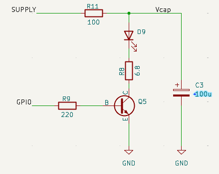
/// caption
Basic Bipolar Switched Emitter
///

This configuration, with an IR LED, would work well in a typical classic micromouse with a 5 Volt supply voltage. However, in a half-size mouse there may not be a 5 Volts supply and so the available headroom for the LED supply becomes marginal. So marginal that the use of a visible light LED like the TLCR5800 is probably not possible at more than a fairly low current.

It is likely tempting to connect the LED supply directly to the battery to get a somewhat higher voltage. but that causes another issue. As the robot runs around, the battery voltage will constantly change and with it, the LED output. If the LED output varies, so will the detector reading, regardless of the walls. 

What is needed is a way to keep the current through the LED constant even if the supply voltage changes.

## Constant current
There are many ways to create a constant current drive. Ideally, the current would be completely independent of VDD but, of course there will be some lower limit below which there will not be enough headroom to fully accommodate the forward voltage drop of the LEDs. These circuits vary in their complexity and effectiveness. With space at a premium, builders want a simple solution wherever possible.

### Simple Solution
The resistor R8 in the previous circuit limits the current that can flow through the LEDs. It has no other purpose. Suppose, however, we place the current limit resistor on the emitter of the drive transistor instead of between the collector and the LED. 

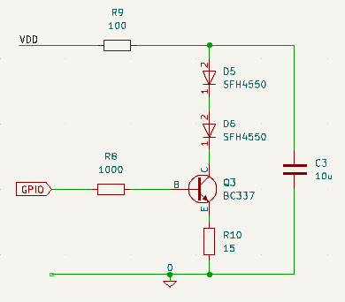
/// caption
Simplest Current Regulation
///

There are the same number of components and they have the same values (Q5 is a BC337-40) but now the circuit behaviour is very different.

As current flows through the LEDs, the voltage at the emitter of Q5 will rise. If it rises enough so that it is within 0.7 Volts or so of the base, the transistor will begin to turn off and the current will reduce. There is, then, negative feedback in the circuit and the current is now controlled only by the emitter resistor, not the supply voltage. 

In this example, suppose the GPIO output is 3.3 Volts. If the emitter of Q5 gets to about 2.6 Volts, the circuit should start to be stable. That corresponds to a current of around 2.6/6.8 = 382mA. In practice, some current will flow from GPIO, through the resistor R8 and out of the emitter. Not much current - less than 1 mA depending on the gain of the transistor. So the total emitter current will include the base current and the collector current will be a little less. Not by much though - less than 2% typically.

The high current requirement, if it can be achieved, will need somewhat more than the typical, rule-of-thumb - value 0.7 Volts for $V_{BE}$. Probably more like 0.8V so the voltage across R8 will be around 2.5 Volts and the actual emitter current will be $2.5/6.8 = 360mA$. Combined with the base current and other transistor effects, the actual current achievable through the LED will be a little lower still.

So what? Well, notice that none of this reasoning has any mention of the supply Voltage. So long as there is enough supply voltage to provide the forward voltage drop of the LEDS, the voltage across the emitter resistor and a volt or so for linear transistor operation, the current should be constant and independent of the supply voltage. Here, anything above about 6.5 Volts will be enough to ensure correct circuit behaviour. That is a convenient number because it is around the voltage that corresponds to a pair of depleted LiPo cells.

In summary, leaving at least one volt to ensure the transistor can operate in its linear mode:

$$
V_{cap} > V_{LED} + I . R_E + V_{CE(sat)} + 1 Volt
$$

The extra 1 Volt ensures linear operation. Remember that the resistor R11 reduces the average voltage value on the capacitor depending on the pulse duty cycle so $V_{cap}$ is always somewhat less than $V_{supply}$.

It should be clear that an attempt to increase the current by reducing the value of the emitter resistor will increase the voltage drop across the LEDs, reducing the available headroom. Even so, it should be possible to get more than 250mA through the LEDs with a 6.5 Volt supply and good pulse shapes. You can double that if you increase the value of the storage capacitor and are happy to accept a pulse that begins to decay rapidly.

Note that, because the transistor is operating in its linear region, it will dissipate a little more power than when operated as a switch. With the example parameters - 328mA for 25us out of every 1000us - the average power dissipation would be around 6mW. Even if the emitter gets stuck on, the protection resistor, R11 keeps everything safely limited.

### Simulating the Circuit

Running this circuit through the simulator shows that the voltage on the capacitor, $V_{cap}$ still takes just as long to get to a stable value but the LED current pulses stabilise well before that.

 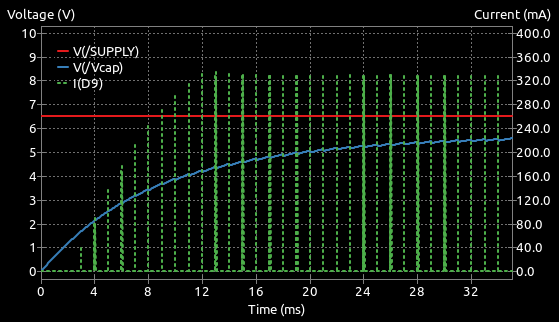
 /// caption
 Basic Bipolar Regulation
 ///

The pulses stabilise as soon as the capacitor voltage is high enough to provide adequate regulation by the transistor. As little as 4.5 Volts on the capacitor is enough and, at all voltages above that, the pulse shape is the same. Here is one of the stable pulses.

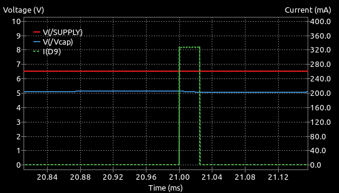
/// caption
Single 328mA pulse from Basic Regulator
///

It is clear that there is no droop and the current pulse is nice and constant. The current rises to the same value as in the switched case but is now sustained throughout the pulse as the transistor compensates for any droop in the capacitor voltage.

### Testing Compliance

Compliance is the ability of the circuit to provide a consistent current for a range of input voltages. The power-up data shown above imply that, as long as the supply voltage is greater than 4.5 Volts, regulation will be good. Just to illustrate the point, the simulation can be run again with the supply voltage set to 8.4 Volts, corresponding to a freshly charged 2S LiPo battery.

 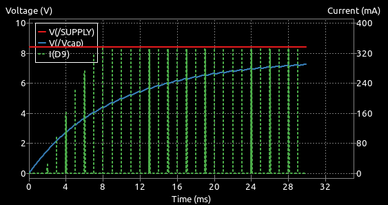
 /// caption
 Basic Regulation With Higher Supply Voltage
 ///

Exactly as before, the pulses stabilise quickly at the same level and remain unaffected by the supply voltage.

A simple test with actual devices in a real circuit confirms the simulation results. The following circuit was used:

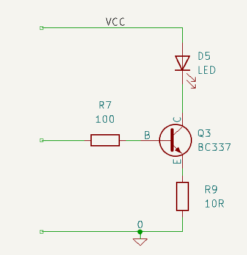
/// caption
Constant Current Driver Compliance Test Circuit
///

Tests were run with a range of values for the emitter resistor, R9 to give currents between about 110mA and 480mA. This was done for both the SFH4550 and TLCR5800 LEDs. The current through the emitter resistor was measured for convenience. This will be close to the LED current so long as the transistor gain is high enough since the emitter current is the sum of the base and collector currents ($I_e = I_b + I_c$).

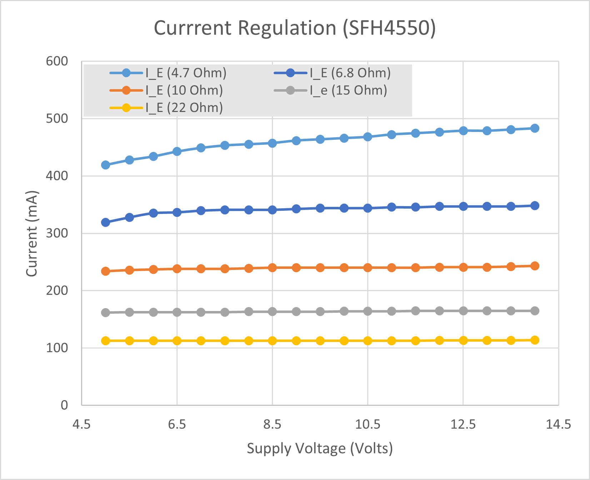
/// caption
Compliance Test - SFH4550
///

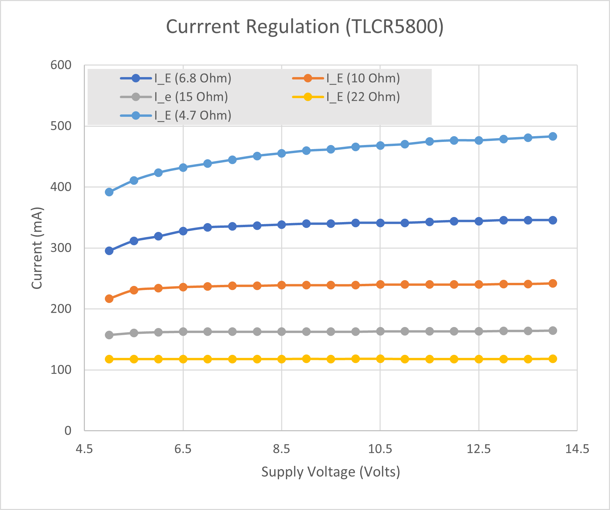
/// caption
Compliance Test - TLCR5800
///

There are three important observations to be made in the data.

- first, at lower currents, up to about 250mA, regulation for both LEDs is very good across a wide range of voltages - extending down to about 6 Volts.
- second, it is apparent from the high current results that regulation is less good. This is largely a result of the normal behaviour of bipolar transistors. At higher currents the transistor’s gain falls, and the collector current becomes more sensitive to $V_{CE}$ due to the [Early effect](https://circuitcellar.com/resources/quickbits/early-effect/), which reduces the effectiveness of the current regulation.
- third, as the LED forward voltage increases with current, the available headroom at lower supply voltages is reduced and regulation suffers.

### Sources of error

This is **not** a *precision* current source. While it can compensate very well for variations in supply voltage, it is subject to some change in the $V_{BE}$ behaviour with temperature and it will be affected by the actual voltage available from the GPIO pin.

In fact, the LED current is proportional to the GPIO voltage. If, for example, the GPIO voltage is only 3 Volts, the voltage across the emitter resistor will be correspondingly lower and the LED current will be reduced. 

However, during normal operation of the processor you can be quite confident that the GPIO voltage will be stable enough for the purposes of this circuit. If it does change, that would be a sign that there may be some other problem in the rest of the robot circuits.

Also, remember that the calculations will refer to typical devices and individual parts are subject to the normal tolerances.

There are some modest sources of error or inaccuracy but overall, for its intended purpose, this circuit is a great improvement over a simple switched emitter. It makes for a simple solution to getting consistent and stable current pulses even with the use of unregulated supplies. In a micromouse robot, where the walls themselves can vary in reflectivity by several percent, it probably needs little or no improvement.

When choosing a transistor for Q5, several types will do the job. Aim for something that can pass several hundred milliamps while still having a current gain of at least 100. The BC337-40 has proven reliable and is cheap and commonplace.

### Circuit Protection

The resistor R11 is there to ensure that the LED will not be destroyed if the emitter is left on because of a software fault. With the existing value of 100 Ohms and a freshly charged battery at 8.4 Volts, the maximum current that should flow through the LED is around 64mA which is well within the maximum permitted value of 100mA. REplacing the LED with a TLCR5800 will result in a slightly lower fault current of 57mA. This is more than the permitted 50mA and so, in that case, R11 should be increased to at least 150 Ohms. This will reduce the available headroom somewhat and current pulses as high as 320mA will start to droop a few percent as the supply begins to approach 6.5 Volts.

Even so, some practical experiments with two popular emitters - the SFH4550 and TLCR5800 - show that the circuit can produce very stable currents across a wide range of supply voltages even with a robust on-current protection setup. The circuit used for the tests is this. (NOTE that the protection resistor is R6 in this version, not R11 as before):

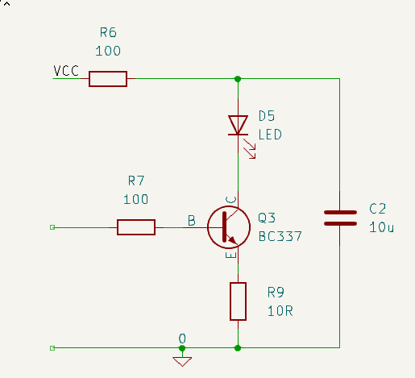
/// caption
Constant Current Driver Compliance Test Circuit With Protection
///

The actual current through the sense resistor was measured for a range of values for $V_{CC}$ with two different LED types and with either 10 Ohms or 22 Ohms to set the current.

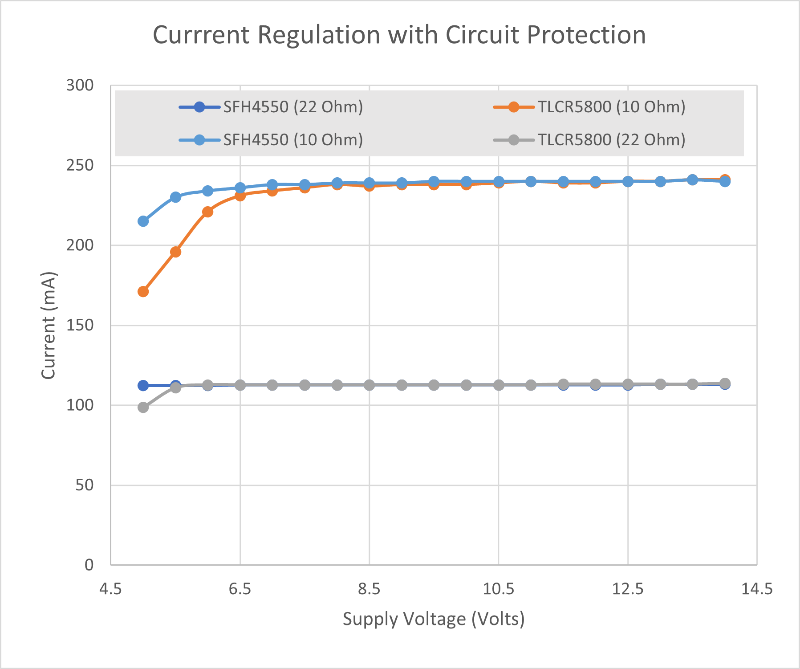
/// caption
Constant Current Driver Compliance Results With Protection
/// 

As you might expect from the preceding discussions, the higher forward voltage of the visible-light TLCR5800 requires a higher minimum voltage before the current is really stable. Aside from that, the LED current remains what was seen without the protection resistor once sufficient headroom has been achieved. For the lower current, the output is stable for both types of LED with a supply of 6 Volts or more. The SFH4550 needs a little more at the higher current but is pretty good from 6.5 Volts. 

This higher forward voltage of the TLCR5800 means the regulation is poor below 8 Volts or so.

Again, bear in mind that, for the most common application using a phototransistor detector, currents much above 200mA are unlikely to be necessary.

### Other LED types

All the calculations so far have been for  an IR LED like the SFH4550. If you wanted to use a high intensity visible type like TLCR5800, the only change will be the minimum supply voltage needed  ensure correct operation at the intended current. With the current still at 328mA, the TLCR5800 will need around 5.75 Volts on the capacitor before the pulses stabilise. That is still, just, possible with a supply voltage of 6.5 Volts but no less. That 6.5 Volts is the lowest that you should allow a 2S LiPo battery to operate at - certainly for more than a few seconds.

Recall that most use cases in micromouse robots do not require LED currents to be that high unless your detector is a photodiode and you need to reduce the load resistance to better match the ADC input.

### 5 Volt GPIO Constraint

The calculations so far assume that the GPIO voltage is 3.3 Volts. That puts $V_E$ at around 2.4 Volts which is a conveniently low value for a sense resistor. While it is somewhat wasteful of 2.4 Volts of headroom, it would be a lot worse with a processor having a 5 Volt GPIO voltage.

In that case, $V_E$ would be 4.3 Volts and would be unlikely to leave enough voltage headroom for correct operation of the circuit unless the supply was 8 Volts or more.

In both cases, it would be possible to reduce the voltage seen by the transistor base if another resistor were added from base to ground, to form a voltage divider. The problem then is that the current through that divider should really be significantly greater than the expected base current in order to make sure the base voltage is relatively stable. As stated before, GPIO pins are unlikely to provide more than about 20mA and that may not prove to be enough for a stable voltage divider on the transistor base. Recall that, to get 250mA from the transistor, you may need 5mA or more into the base. Even if you want to divide the GPIO voltage by two, you may need surprisingly unequal resistors in the voltage divider. 

#### 5 Volt Example

Let's work through an example. Suppose your requirements are for an LED current of 150mA, you have a processor with 5 Volt IO and you are happy with a voltage at the emitter, during a pulse, of 1 Volt.

- $I_{LED} = 0.15 A$
- $V_{IO} = 5.0 V$
- $V_E = 1.0 V$

You can assume the the transistor gain (beta, $\beta$) is 50 or more and therefore the emitter current is very close to the collector current value, $I_{LED}$.

Now:
$$
R_E \approx \frac{V_E}{I_{LED}} = \frac{1.0}{0.15} = 6.67 \Omega
$$

So we can set $R_E$ to be 6.8 Ohms as the closest standard value.

As long as we are operating in the transistor's active region, the base will be about 0.7 Volts more positive than the emitter so 

$$
V_B = V_E + 0.7 = 1.7 V
$$

If the transistor $\beta$ is at least 50 for these currents, the base will need to take

$$
I_B = \frac{I_E}{\beta} = \frac{0.15}{50} = 0.003 A
$$

At modest currents of 100-300mA, $\beta$ is likely to be higher than this, depending on the transistor choice, and the base may only need less than 1mA. Now assume that you are happy to have the GPIO pin supply 10mA during the pulse. The sum of $R_A$ and $R_B$ should be 

$$
R_A + R_B = \frac{V_{IO}}{I_{IO}} = \frac{5.0}{0.010} = 500\Omega
$$

Calculate the value of $R_A$ needed to drop (5.0-1.7) Volts at a current of 10mA

$$
R_A = \frac{V_{IO} - V_B}{I_{IO}} = \frac{5.0 - 1.7}{0.01} = \frac{3.3}{0.01} = 330\Omega
$$

Which is a convenient standard value. The resistor $R_B$ will be taking a slightly smaller current because some (3mA) has to flow into the transistor base

$$
R_B = \frac{V_B}{I_{IO} - I_B} = \frac{1.7}{0.010 - 0.003} = \frac{1.7}{0.007} = 240\Omega
$$

The closest standard value is 220 Ohms. 

The sum of these is a little larger than previously calculated but should still allow sufficient current to flow from the GPIO pin to supply the transistor base while maintaining the base voltage.

Here is the final circuit:

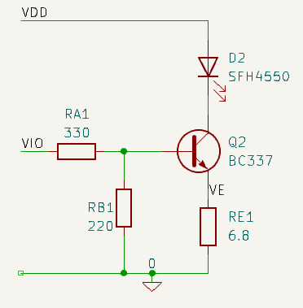
/// caption
Current Control with 5V GPIO
///

The circuit can be simulated using ngspice in KiCAD to calculated the DC operating point. Note that the circuit would never run like that continuously - it is designed for pulsed operation. Ngspice does not let the smoke out of mistreated components.:

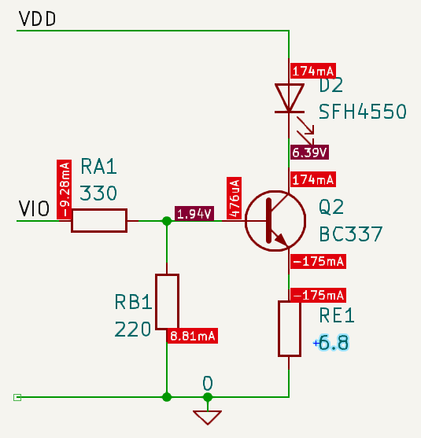
/// caption
Simulated Operating Point for Current Control with 5V GPIO
///

In the simulated circuit, the value of $V_{DD}$ is 8 Volts

Measurements from a breadboarded version of this circuit give an LED current of about 140mA while the SPICE simulation shows it to be 175mA. The differences are due to component variation and the actual transistor gain, $\beta$, being lower than that assumed in the simulation but more than the value of 50 assumed in the calculation. In a practical circuit, you could adjust the emitter resistor if a specific LED currrent had to be achieved.

A solution like this can also increase the headroom by reducing the emitter voltage but the tradeoff is a significantly increased current drawn from the processor pin. In the built version of this example circuit, pulse current regulation was excellent all the way down to $V_{DD}$ of 4.2 Volts.

### Possible Improvements

Now that the LED current pulses are better regulated, it might be worth revisiting the reservoir capacitor calculation. Large value surface mount Tantalum capacitors are expensive and take up space so you might consider reducing the value. In this circuit, and still using 328mA pulses through a SFH4550 LED, the capacitor C3 can be reduced to as little as 10uF and still give good current pulses. The ripple on the $V_{cap}$ voltage will be much greater and the circuit should still operate at the lower limit of the intended supply range. Because the transistor is regulating the current through the LED, the actual value if $V_{cap}$ is less critical. With a visible light LED, the pulses will begin to droop fairly quickly. As already mentioned, consider reducing the current to manage that.

Take care though before using MLCC capacitors instead of Tantalums. Typical MLCC capacitors do not give anywhere near their rated capacitance once they have a few volts of DC bias across them. Also, the smaller the package, the worse the effect. This is not the place to go into detail but, if you *must* use MLCC types, make them at least four times larger than you calculate and avoid small packages like 0603 or 0402.

For through-hole use, most Aluminium electrolytic capacitors rated at 16 Volts or more will be adequate. That is the type of capacitor used in the practical tests above.

### Other Current Regulators

If you feel the need for more reliable, accurate, or novel solutions, have a look at the [Improved Current Regulation]() page.

