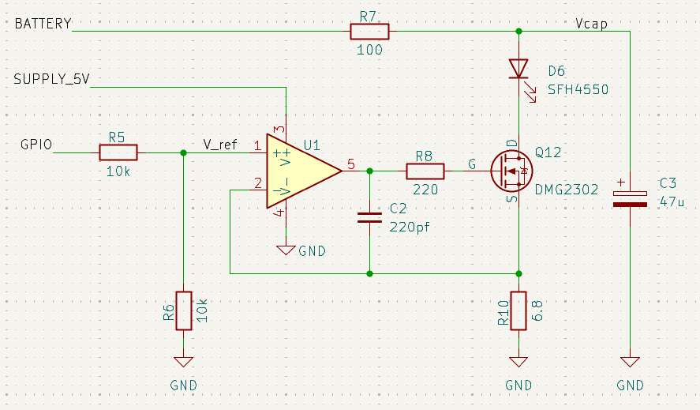
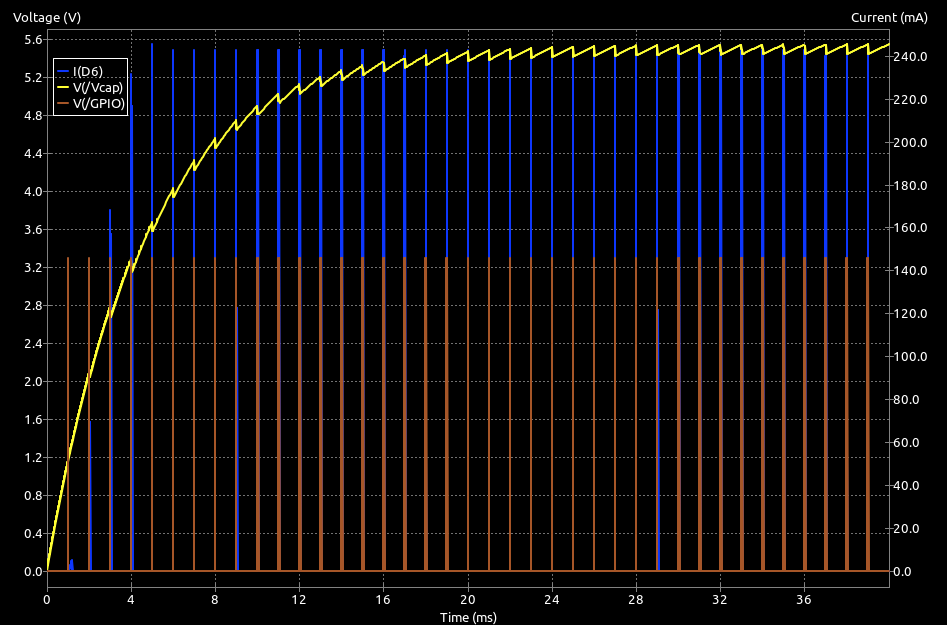
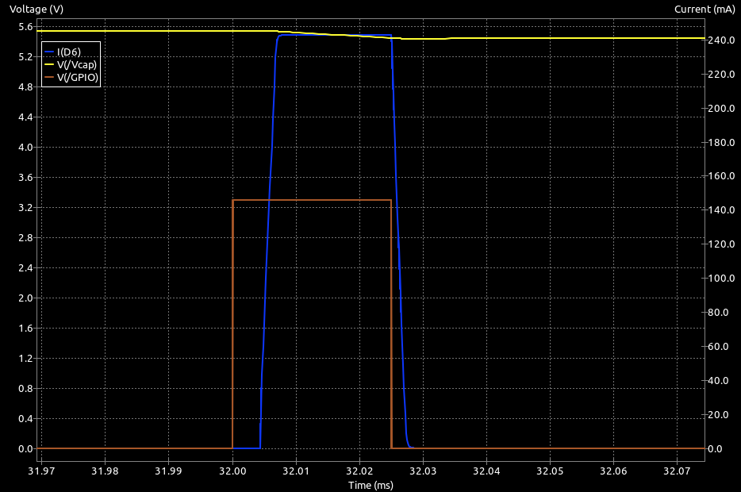

---
# 1. FRONT MATTER (REQUIRED)
# The MkDocs title is automatically used for the navigation and the page heading.
# title: Template
subtitle: 
description:
# icon: octicons/dot-fill-16
icon: octicons/dot-16
# icon: octicons/dash-16
# icon: octicons/chevron-right-12
status:
---

# Advanced Emitter Control

This page will examine some other options for controlling the emitters.

## Better Current Sink

Improved constant current circuit with better regulation. More parts though.

### MOSFETS

One of the improvements for the basic switched emitter control was to replace the bipolar transistor with a MOSFET. In the basic constant current circuit, the MOSFET can also be simply swapped with the BJT - the source goes to the current sense resistor, the gate to the GPIO and the Drain to the LED cathode. This illustration is for a high-current emitter drive. More commonly the sense resistor, R8, would be larger.

/// caption
High Current Bipolar Current Regulation
///

There are, however, a couple of issues that should give you pause for thought.

The first problem is finding a suitable device. MOSFETS are voltage operated devices. As the voltage on the gate, $V_{GS}$, increases, the resistance between Drain and Source will decrease. The gate draws very little current when operating normally aside from the brief charge/discharge current associated with the gate capacitance during switching. If you look at datasheets for typical MOSFET devices, you will see a value quoted for the gate-source threshold voltage ($V_{GS(th)}$). This is the gate voltage at which the body of the MOSFET only just begins to conduct. The Drain-Source resistance, $R_{DS}$, will still be quite high. Typical values for ($V_{GS(th)}$) are given for drain currents in the hundreds of microAmps, not the tens or hundreds of milliAmps the sensor needs.  

As $V_{GS}$ increases, the value of $R_{DS}$ will fall, often to quite small values. Elsewhere in the datasheet, you will often find some minimum value, $R_{DS(on)}$ with a corresponding $V_{GS}$. Alternatively, you might see a maximum continuous current, again with an associated $V_{GS}$. Although the datasheet might indicate that the maximum current can be large, that will be with the lowest value for $R_{DS}$. High-performance MOSFETs may have $R_{DS(on)}$ as small as a few tens of milliOhms while small through-hole parts might only be able to get $R_{DS(on)}$ down to one or two Ohms.

It is important to realise that, while a low $V_{GS(th)}$ might be essential for operation in this circuit, it is not a reliable guide to the $V_{GS}$ required for correct operation at the intended LED current.

The ZVN4206A is an attractive MOSFET in a convenient TO92 package. See the [datasheet](https://www.diodes.com/assets/Datasheets/ZVN4206A.pdf){target="_blank"}

In the datasheet for the ZVN4206A, $V_{GS(th)}$ is given as no more than 3 Volts. It could, then, be turned on by a GPIO pin delivering 3.3 Volts. However, this overlooks the voltage across the current regulating resistor. The key parameter for the MOSFET is the voltage between gate and source, not the voltage between the gate and ground.

Remember that common LED currents might be in the 100mA to 200mA range for a phototransistor detector but much higher pulse currents may be desired when a photodiode detector is used.

Suppose then that you want 150mA through the LED and the current sense resistor is 5 Ohms. That resistor will drop (0.15 * 5) = 0.75 Volts. That becomes the voltage at the MOSFET source. Now you need to raise the gate voltage by at least another 3 Volts just to get the transistor operating. Clearly, only a 5 Volt GPIO output can manage that.

As the current through the MOSFET rises, so too does the voltage across the sense resistor, reducing $V_{GS}$ from its initial value of 5 Volts. This increases the MOSFET resistance and raises $R_{DS}$ until an equilibrium is reached and the current becomes stable.

Just like the bipolar version of this regulator, there must still be some headroom in the supply voltage for the MOSFET to operate correctly. If the value of $R_{DS(on)}$ cannot fall low enough with the available $V_{GS}$, the transistor will saturate and regulation is no longer possible. The supply voltage must exceed the sum of the LED forward voltage, the sense resistor voltage drop, and the MOSFET's required $V_{DS}$ for regulation.

In short, it should be possible to replace the bipolar transistor used in the basic constant current circuit with a ZVN4206A MOSFET. BUT **only** if you have a 5 Volt GPIO pin. With a 3.3 Volt GPIO level, it is unlikely to work without very small sense resistor values. Even for the same part number, some devices can have $V_{GS(th)}$ as low as 1.3 Volts while for others it may be 3.0 Volts. You really want more certainty than that. A device like the ZVN4206 is going to be effectively unusable with only a 3.3 Volt gate drive.

#### Logic-Level MOSFETS 

There are MOSFET devices with lower values for $V_{GS(th)}$ and which can reach low values of $R_{DS}$ even for relatively small gate voltages. These are typically described as "logic-level" MOSFETS, designed to switch on fully with a 3.3V logic '1' from a GPIO pin. Unfortunately, these are rare in friendly, small packages for through-hole use. They are, however, plentiful in SMT packages like SOT-23. Although not marketed as a 'logic-level' device, the DMG2302-UK [Datasheet](https://www.diodes.com/datasheet/download/DMG2302UK.pdf){target=" blank"} is available in a SOT-23 package and can achieve $R_{DS}$ as low as 100mOhms with $V_{GS}$ of only 2.0 Volts as well as being capable of handling short (<10$\mu$s) pulses of 12 Amps.

When selecting a device to be used in this current regulating circuit, always bear in mind the additional voltage at the Source pin due to the drop across the current sense resistor.

---

#### Summary

When selecting a MOSFET for this circuit, remember:

- The source voltage rises with LED current because of the sense resistor
- The effective gate-to-source voltage is reduced by that amount
- The MOSFET must be able to reach a suitably low $R_{DS}$ at that reduced $V_{GS}$
- It is challenging to design a source-follower current regulator because the $I_D - V_{GS}$ relationship is less well defined than for a bipolar device. 
- Variations between devices may need the sense resistor to be adjust-on-test

### Op-amp Feedback

The circuits used so far rely on the GPIO providing a fixed voltage and a sense resistor that drops enough voltage for the transistor's $V_{BE}$ (for bipolars) or $V_{GS}$ (for MOSFETS) to fall to the point where current begins to self-limit. This generally works well so long as the supply voltage provides sufficient headroom and the GPIO voltage, $V_{IO}$, is high enough to drive the transistor correctly. When using a bipolar transistor, there must also be enough current available from the GPIO pin to drive the base. In extremes, that current may be large. With MOSFETS, the gate voltage needed to bring $R_{DS(on)}$ down to a useable value may be more than is available from the pin. Device-to-device variations make it difficult to design reliable, repeatable circuits.

As the required current increases, headroom is lost in two ways: the sense resistor drop increases, and the transistor needs more drive current (for bipolars) or voltage (for MOSFETS).

Modern processors can only provide 3.3Volts at their GPIO pins, it does not take much sense resistor voltage before you can no longer provide sufficient drive to the base or gate to maintain regulation.

To make matters worse, the $V_{GS}$ voltage needed by many MOSFETS to get the value of $R_{DS(on)}$ low enough for correct regulation may already be more than the GPIO pin can provide. As the source voltage rises, the available $V_{GS}$ becomes even smaller.

Another consequence of increasing the sense-resistor drop is a reduction in the total headroom available from the supply so that your ability to work with lower supply voltages is compromised.

A more robust approach is to use an op-amp in the feedback path. The op-amp compares the voltage across the sense resistor with a reference voltage on its other input. Since the op-amp inputs draw essentially no current, the reference voltage can be set to any convenient value, independent of the value of $V_{IO}$. The op-amp can then drive the transistor, of either type, with whatever is needed (within its supply limits) to achieve the desired current. For MOSFETS in particular, the circuit no longer depends on the exact shape of the $I_D - V_{GS}$ relationship and you get consistent, reliable results even if the GPIO voltage is too low to drive the transistor directly.

By setting the reference voltage to some low value - perhaps 0.5 Volts or 1 Volt - you ensure that the same low voltage will be dropped by the sense resistor, leaving more of the LED supply to available to drive the LED. As in other circuits, there will still be some voltage greater than the saturation voltage lost to the transistor if it is to operate in its active region, but the overall headroom is improved.

#### Example Circuit:

Here is a basic current sink using an op-amp for the feedback to a MOSFET.

/// caption
Op-amp Feedback Regulator
///

Much of the circuit should look familiar by now but the addition of the op-amp means a few extra components. 

 - There is still a resistor from the op-amp output to the MOSFET gate. This helps with stability and limits any large current spikes that might otherwise be present during switching due to the gate capacitance. This resistor limits the op‑amp’s slew‑rate demand and prevents the MOSFET’s gate capacitance from appearing as a heavy capacitive load directly on the op‑amp output.
 - The GPIO voltage is applied to a potential divider to create a reference voltage. In this case the reference is half the 3.3 Volt GPIO voltage. You could choose a higher or lower reference, 1.65 Volts is selected here for convenience. It is small enough that the voltage drop in the sense resistor is modest but not so small that the sense resistor value is comparable to the trace resistance in the PCB. Note that the divider can use larger resistors, here 10k, to greatly reduce the current needed from the GPIO pin. Since the op-amp takes no current at its inputs, there is no load that will affect the reference voltage.
 - The sense resistor is now easy to calculate because the only concern is that it drop 1.65 Volts at the desired current. With a MOSFET, the drain and source currents are equal and, again, no current is drawn by the op-amp inverting input. 
 - The capacitor, C2, between the op-amp output and its inverting input may not be needed but it helps to ensure stability by reducing the gain at high frequencies. The capacitor forms a dominant‑pole compensation network with the sense resistor and MOSFET transconductance, ensuring the feedback loop remains stable across device variations. The 220pF value is likely to be fine here. Some experimentation may be needed if greater compensation is needed in the final, built circuit. Even if this capacitor proves not to be needed, it is a good idea to provide the pads on the PCB so that a suitable value can be added.

As a practical example, consider that you might want 250mA through the LED - $I_{LED}$. The sense resistor is easily calculated as  

$$
R_e = \frac{V_{ref}}{I_{LED}} = \frac{1.65}{0.250} = 6.6\Omega
$$

The closest standard value would be 6.8 Ohms, as shown in the diagram.

Running this circuit through the ngspice simulator in KiCAD, you get the following output:

/// caption
Op-amp Feedback Simulated Output
///

The supply voltage for this run was only 6 Volts. You can clearly see that the reservoir capacitor gets charged to around 5.5 Volts, leaving plenty of headroom for the LED and proper current regulation. The current pulses are at 243mA which is exactly what you would expect. ($1.65/6.8 = 0.243).

A closer look at a single pulse shows one of the possible drawbacks of this approach.

/// caption
Op-amp Feedback Simulated Single Pulse
///

The pulse output is delayed by about 5$\mu s$ and its leading and trailing edges are distinctly slower. The longer rise- and fall-time are not terribly significant and may even help reduce interference in other circuits on the board. The delay is simply the cost of doing business with a more complex circuit. The op-amp has a finite slew rate and some time is needed to charge the MOSFET gate. It will have almost no effect on the practical use of the sensor so long as you remember to take it into account when setting up the sampling time.

There are a few considerations when selecting the op-amp. It should have:

- rail-to-rail IO
- low noise
- low common-mode range
- good stability when driving a capacitive load

The Microchip MCP6001U is a good choice. Note that it is only rated for a supply voltage of up to 6 Volts so you cannot use the battery voltage. Be sure that the MOSFET you choose can still pass the required current with $V_{GS} <= 5 Volts$. Note that you do not have to account for the sense resistor voltage drop. All 5 Volts is available for the gate.

If using a MOSFET, look for a device with a guaranteed $R_{DS(on)}$ rating at $V_{GS} <= 4.5 V$. Many logic-level MOSFETs only specify performance at higher voltages. The DMG2301U can get $R_{DS(on)}$ under 0.1 Ohms at $V_{GS} = 4.5 Volts$

The circuit will also work with a bipolar transistor with only minor changes. If you are working with through-hole parts, the BC337-40 will be fine.

## Multiple Output Levels

The requirements for running along orthogonal straights and diagonal straights are a little different since the range of expected sensor signals changes with the orientation and distance of the walls. Diagonal running can produce much stronger responses than orthogonal paths. To deal with that, some builders have a reduced emitter output that is used only for diagonals.

The op-amp feedback circuit offers a simple solution for this. Since the reference voltage is derived from a potential divider connected to a GPIO pin, you could use two pins to select between different reference voltages. The reference voltage determines the current, along with the sense resistor.

## Constant Current Diodes

There are a number of integrated current regulating devices in two-terminal packages. These are sometimes described as *current regulating diodes* or *Two Terminal Constant Current LED Driver*. One example is the [AL5809Q](https://www.diodes.com/datasheet/download/AL5809Q.pdf){target="_blank"} family. They claim a current accuracy of 3% or better over a very wide range of operating voltages. There are specific devices available with fixed currents including 100mA, 120mA and 150mA. They can simply be placed in series with one or more LEDs - effectively replacing the current limit resistor in a switched emitter design. All you need to turn the emitter on is a basic low-side transistor switch.

Internally, they have a complete current regulator and will operate with an external voltage between the pins from 2.5 Volts to 60 Volts. Add to that the switch voltage and LED forward voltage. 

For micromouse wall sensors, so long as you are happy with one of the available currents, these devices will let you connect the emitter LEDs directly to the battery so long as you have at least two cells.

The datasheet notes that the current can be increased by connecting two or more AL5809Q devices in parallel. This might be a good way to implement multi-level current control for the sensor emitters.

### Pulse Width Constraint

Before committing to the use of these devices, be aware that the datasheet states that the minimum pulse width should be 500$\mu s$ and the rise-time appears quite slow at 50$\mu s$ or so. Careful testing should be undertaking but they may still be suitable for systems with a relatively low sample rate.
