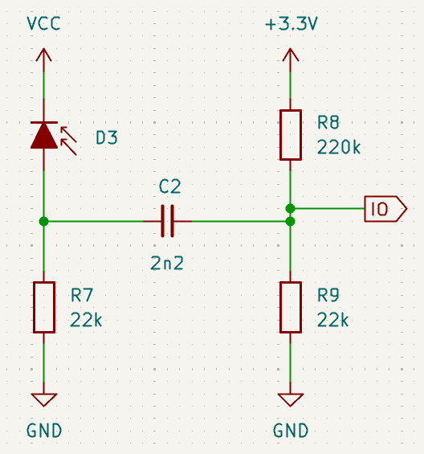

# Classic AC Coupling

To remove DC components of a signal, the classical approach is to pass the signal through a series capacitor, often feeding it to a voltage divider to re-establish a new DC baseline before further processing. You may see the technique described as either 'AC coupling' or 'DC blocking'. In this context, they are the same thing.

A typical circuit may look like this:

/// caption
Classical AC Coupling Circuit
///

The circuit is suitable for both photodiode and phototransistor detectors and adds just three components to the basic circuit. The AC coupling capacitor, C2, ensures no DC ambient component is passed through to the potential divider created by R8 and R9. Those two resistors set the lowest value normally seen by the IO pin. In this example, R8 is 220k and R9 is 22k so that, with a 3.3V supply, the voltage at the IO pin is fixed at 0.3 Volts:

$$
V_{io} = 3.3 \times \frac{R9}{R8+R9} = 3.3 \times \frac{22}{220+22} = 3.3 \times 0.0909 = 0.3
$$

 While it may seem a very simple circuit, there are some interesting issues to consider.

  - **Lost dynamic range**: because the IO pin is fixed at 0.3 Volts when there is no pulse signal, the available measurement range is reduced by 10%
  - **High ADC input impedance**: from the viewpoint of the IO pin, the source impedance is the parallel combination of R8 and R9 which will be 20k. This is a bit high for an ADC source and you should take care to ensure a suitable sample and conversion time. The STM32 data sheets will tell you that it is not possible to get accuracy to 12 bits with such a high input impedance but the results are likely to be pretty good with care.
  - **Higher DC gain at the detector**: For the DC component of the photocurrent generated by the detector, the load in this circuit is the 22k of R7. However, Any AC component, of a suitably high frequency, will see the capacitor as a low impedance and the two resistors R7 and R9 will appear in parallel giving an effective load of only 10k. This means the response _at the detector_ to DC is twice the effective response to the AC components. We still get our 3 Volts dynamic range at the IO pin but any DC component will steal a larger voltage from the detector than we might like. DC current only sees R7, AC current sees R7 and R9 in parallel. So long as it is possible to take the detector supply to a higher voltage, we can probably live with this since the processor only gets to see the AC component.

## Circuit Operation

The three issues above are related to the choice of values for the circuit, and the way they interact. It is appropriate then to look closely what is going on in this deceptively simple circuit.