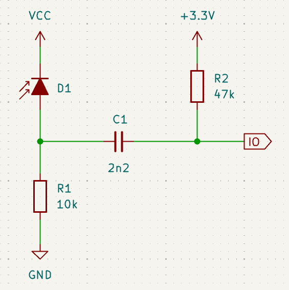
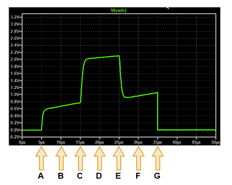

# Duncanplexer Ambient Cancellation

A recurring problem with wall sensors is the mitigation of constant background illumination. The resulting bias on the load resistor steals dynamic range from the ADC converter by ensuring that the bottom part of the available range can not be used. In electronic systems, a common solution for blocking DC components of a system is to pass the signal through a capacitor. However, the signal measured by the ADC must have some DC component so the challenge is to resolve these apparently conflicting requirements.

In a UKMARS online meeting, one of our members, Duncan Louttit, proposed a novel sensor sampling method that aims to eliminate the effect of DC illumination, reduce interfering noise and increase dynamic range. Adding a single capacitor and resistor, along with a couple of software tricks, greatly improves the ability of the sensor to reject DC ambient components.

### The Circuit

His circuit uses a photodiode, reverse biased in photoconductive mode, with the output AC coupled through a small capacitor to the processor IO pin. The pin can be configured as an output or as an ADC input and is pulled up to 3.3Volts by means of a resistor.

/// caption
Duncanplexer Circuit Arrangement
///

The circuit effectively decouples the sensor signal from any DC light level, such as sunlight, that might be present  - blocking it with the capacitor C1. The AC reading due to the emitter pulse is passed through the capacitor to the processor IO pin. R1 and R2 form a bias network that defines the IO pin’s resting voltage when in analogue mode. C1 must be small enough to settle quickly but large enough to pass the emitter‑pulse transient without excessive attenuation.

You will see that the photodiode is taken not to 3.3 Volts but some unspecified $V_{CC}$. One of the limitations of many sensor circuits is that they suffer from limited dynamic range. Not only are they connected to the same 3.3Volt supply used by the processor, as the response start to get close to that voltage, the sensor becomes non-linear. Phototransistors are particularly prone to this but photodiodes also need some headroom for correct operation in a circuit like this. Also, if you care about every last nanosecond of response time, the rise-time of a photodiode detector will change with the reverse bias, and that will change with the size of the response. With a little care, $V_{CC}$ could be the battery voltage or any other suitable voltage in the system. 

By taking the photodiode cathode to some higher voltage, that headroom can be maintained over a wider range of responses. In particular, even very high levels of steady ambient lighting will just produce a fixed offset that will be blocked by the coupling capacitor. Within reason, the higher the value of $V_{CC}$, the greater will be the level of ambient that can be rejected. Photodiodes are linear over very wide ranges of ambient illumination and can produce essentially identical pulse responses across nearly all that range .

While it is not a good idea to design a circuit that might normally exceed the input voltage of a processor pin, in this case the effect should be reasonably safe. The photocurrent is unlikely to exceed 100uA or so and then only for a few microseconds. The internal ESD diodes in the processor can easily handle that without great risk but be aware you are going to be contributing to the system noise. That current has to go somewhere and that will be the ground pins of the processor, slightly raising the ground potential. Still, designers should verify the processor’s absolute maximum ratings and consider adding a small series resistor if in doubt.

### The Response

The operation of the circuit relies upon the user code changing the mode of the IO pin when sampling. An annotated simulation in LTspice predicts this response:

/// caption
Duncanplexer Signal
///

And here is a typical output recorded at the IO pin during one cycle of the sensor operation. In this example, the events have been arranged at regular 5 microsecond intervals, triggered by a timer, to keep the code and explanation a little more clear. Actual operation may use variable timing and simple wait loops to perform the ADC sampling.

/// caption
Duncanplexer Signal
///

(You can see small glitches in the signal that are the result of the change in pin function on the processor. They do not affect the measurement.)

This method is particularly well‑suited to photodiodes because their response is fast and linear, making the AC‑coupled pulse easy to isolate. Because the signal is AC‑coupled, the pulse appears as a transient bump rather than a sustained level, which is why precise timing of the ADC samples is essential. 

The sequence of operations is:

**A.  The IO pin is set to be an analogue input**

:   As soon as the pin is set to analogue input mode, it will be high impedance and the voltage will rise to a value determined by the voltage divider formed by R1 and R2. In the example, this will be 
$V_{IO} = 3.3 * R1 / (R1 + R2) = 0.58 Volts$

    Once that voltage is reached, if nothing else happens, $V_{IO}$ will continue to rise as C1 charges up to 3.3 Volts through R2.

**B. Take the first ambient reading**

:   In practice, $V_{IO}$ does not instantly rise to its starting voltage, there will be a short delay of a microsecond or two after which time it is safe to capture the first ambient light reading. 

    In this example it was convenient to use a timer interrupt every 5 microseconds to trigger events so a conversion is started at point B. 

**C.  Start the emitter pulse**

:   If using the timer, the ADC result will be ready for collection, so grab that and store it as $A_1$.

    Now the sensor's emitter can be turned on to start the emitter pulse. The photodiode detector may take a microsecond or two to fully respond so you need to wait a little before grabbing the pulse reading

**D.  Sample the pulse signal**

:   With the photodiode response fully realised, it is safe to start an ADC conversion to read the pulse value.

**E. End the emitter Pulse**

:   The ADC will have finished converting the pulse signal so you collect that and store it in a variable, $P$. 

    Once that is done, the emitter can be turned off. As with the start of the pulse, it may take a few microseconds for the pulse signal to discharge. so you need to wait.

**F. Take the second ambient reading**

:   It was noted earlier that the voltage on the pin will continue to change regardless of the pulse signal. Mostly, that will be due to the influence of R2 charging the capacitor but some ambient illumination will also contribute to this to either increase or decrease the voltage. If you take a second reading of the ambient now, you can compensate for those changes. Unless you do that, the pulse reading may appear to be artificially high. Mostly, that is unlikely to be a problem as it will be monotonic and the circuit's response to 100Hz or 120Hz mains interference is already greatly attenuated. However, to be safe, start a second conversion for the new ambient.

**G. Set the IO pin to output low**

:   Now that the ADC conversion is complete, store the result in a variable, $A_2$.

    Finally, the pin is re-configured as an output and set to zero to discharge the capacitor, C1, completely. The pin will stay in this state until the next cycle.

### The Results

At the end of this sequence, the amplitude of the pulse signal is easily calculated:

$$
V_{pulse} = P - (A_1 + A_2) /2
$$

In this calculation, the ADC samples are all begun at fixed intervals and we do not know exactly when the conversion takes place. However, it will be the same, relative to the start request, in each case and the pulse sample should happen exactly half way between the two ambient samples and you can simply assume a linear change in the voltage between those samples.

### Notes

When your processor has a suitably fast ADC (samples in a microsecond or two), This is a simple technique that allows you to eliminate DC ambient lighting effects and greatly reduce the effect of variable ambient lighting. It is fast and reliable once you have worked out how to change pin configuration quickly. 

Be aware though that some environments, like Arduino and MicroPython, may have quite lengthy or involved code hiding under their pin config and analogue API calls. The hidden and unpredictable delays may reduce the effectiveness of the method. If you are happy to work directly with the hardware though, this is an effective solution.

### Duncanplexing?

If you are wondering where the name comes from, Duncan says the principle comes from recalling the [Charlieplexing](https://en.wikipedia.org/wiki/Charlieplexing) technique of setting pins as input, output or high impedance to enable more functionality than the number of pins might suggest.

