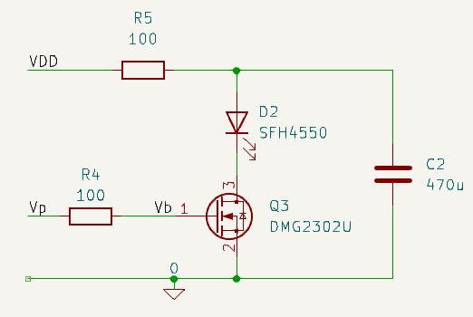

# Extreme Switching

!!! warning "Don't do this at home"

    What follows is not a proposed solution. It is included for completeness in case the idea occurs to you one dark and troubled night when the monsters under the bed are at their most persuasive. 

    It should help you to see why a properly designed, current-controlled driver is a better choice

It may occur to you to wonder what would happen if the current limit resistor were to be removed entirely. Just connect the LED between the capacitor and the transistor. 

As the current through a LED increases, so too does the forward voltage drop. For the kinds of visible light and infra-red LEDs used in wall sensors, you can expect forward voltages of between 2 and 3 Volts at moderately high currents. If the sensor circuit contains, for each LED, a protection resistor of 100 Ohms and a reservoir capacitor, say 470uF, the average voltage on that capacitor will be less than the supply voltage. What remains might be only just enough to self-limit the LED current.

## MOSFET Version

Now suppose you have only a 3.3 Volt regulated supply available and you connect a MOSFET as a simple switch that permits current to flow from the reservoir capacitor, through the LED and transistor but without any current regulating or current limiting resistor. Clearly, the maximum voltage that can be dropped by the LED is the capacitor voltage less the transistor saturation voltage.

/// caption
Extreme MOSFET Switched Emitter
///

All you can know is that the MOSFET is fully saturated and so assume that the $V_{DS}$ is zero for now, although in practice it might be some small value like 0.1 Volts because of various circuit element resistances. The LED characteristic is not well defined and, even if it were, what is its forward voltage going to be in this circuit? All you can do is calculate an estimate of the pulse current and work from there. 

Assume you target 500mA pulses of 25$\mu s$ every 1000$\mu s$. The average voltage dropped by the protection resistor can be calculated:

$$
\begin{align}
I_{peak} &= 0.5 \\
Duty\ cycle &= 25\mu s / 1000\mu s = 0.025 \\
I_{avg} &= 0.5 * 0.025 = 12.5mA \\
V_R &= I_{avg} \times 100\Omega = 1.25 V \\
\end{align}
$$

Also assume the LED is an SFH4550. The SFH4550 datasheet tells you that the forward voltage at 500mA should be around 2 Volts. That all seems quite reasonable since the average capacitor voltage, plus the LED forward voltage, adds up to very close to the supply voltage. So you might conclude that the LED pulse current is indeed close to 500mA.

The circuit can be built on a breadboard and tested with 25$\mu s$ pulses at 1kHz. The transistor is a DMG2302UK MOSFET and the triggering pulses are 3.3 Volts from the GPIO through a 100 Ohm resistor. 

/// caption
Extreme MOSFET Switched Emitter Rsults
///

The transistor immediately saturates because $V_{GS}$ is not affected by the source current and that particular MOSFET can saturate with $V_{GS}$ as low as 1.5 Volts. The average voltage drop across the safety resistor is 1.2 Volts which makes the average current 12mA. With a duty cycle of 2.5%, the peak current during the pulses must be something like $0.012 / 0.025 = 480mA$. The oscilloscope recorded a forward voltage of 2.02 Volts. 

The circuit naturally seeks an equilibrium. Higher LED currents discharge the capacitor faster, increasing the voltage drop across the safety resistor, which in turn reduces the voltage and therefore the current in the next pulse.
So, the result is very close to the prediction.

The results are gratifying but are they reliable?

The actual pulse current available would depend heavily on the $I_F - V_F$ characteristics of the LED in use and may vary substantially from one part to another, as well as with temperature, supply tolerance, and component tolerances. A solution like this is likely to be variable from instance to instance rather than repeatable and will depend on a number of factors that may not be easily controllable. Extending the pulse length will significantly affect the behaviour. For example, a longer pulse will actually reduce the LED current because the safety resistor drop would increase. In the extreme, of course, you would be operating with only the current permitted by the safety resistor which might result in only a few tens of mA. 

Note the use of a large reservoir capacitor. If that were reduced to, say, 47uF, the pulse current would quickly droop as the capacitor charge is depleted. That must reduce the average current so the average voltage on the capacitor must increase. You might think that would allow more current to flow in the LED and you would be right, but only at the start of the pulse. The droop would be quite substantial and by the end of the pulse the current would be significantly less. Furthermore, it is not easy to predict the overall effect on the light output. In the breadboarded circuit, reducing the capacitor to 47$\mu$F reduces the average current to just 70mA but it is difficult to say exactly what that does to the shape of the pulse or the current in the LED at the time that you sample with an ADC.

This circuit is not very amenable to analysis. Small changes in parameters may shift the operating point significantly. There is no real control over the LED current, you are simply asking for whatever can be given by the charge on the capacitor. If you really want to try it, then considerable experimentation might be required though you may decide that to be a worthwhile tradeoff for the extreme minimalism.

## Bipolar Version

Can the same method work with a bipolar transistor like the BC337-40? Well, yes, quite possibly. The base drive will need a bit more thought and the $V_{CE}$ might be a bit of a problem but the basic idea is the same.

Work it through using the same parameters as for the MOSFET:

You need to make sure the transistor is fully saturated. Remember that at high currents the transistor gain, $\beta$, is going to be relatively small. Assume that is is only about 50 and you want to allow for the same 500mA through the LED. That means you need 10mA into the base. If the transistor $\beta$ turns out to be higher, less base current will be drawn and no harm done. At high currents, $V_{BE}$ may be 0.8 Volts. With 3.3 Volts from the GPIO, the largest base resistor that lets you push 10mA into the base is:

$$
R_B = \frac{3.3 - 0.8}{0.01} = 250 \Omega
$$

For a bit of extra margin, choose 220 Ohms.

Assume now that the transistor saturation voltage is 0.2 Volts so there will likely be less available voltage for the LED. Choosing 500mA as your first guess, you can re-use the previous calculations to get the voltage available to the LED: (3.3 - 1.25 - 0.2) = 1.85 Volts. The SFH4550 shows that the likely current associated with that forward voltage is going to be nearer 400mA than 500mA. The circuit will probably settle somewhere a little above 400mA.

---

## Summary

So, yes, you can make a sensor emitter like this and it will indeed create pulses of current through the LED. What you cannot do, however, is control exactly how big those current pulses are, what their shape will be and then repeat the setup from circuit to circuit. Everything is a bit of a gamble on individual component values and characteristics. 

!!! note 

    - Note the desirability of the large capacitor. That will need to be a Tantalum SMD or electrolytic through-hole part to ensure a low Equivalent Series Resistance (ESR), and will be physically large and expensive. You probably want one per emitter.
    - This is only suitable for a 3.3 Volt stabilised supply. Try it with a 5 Volt supply, or straight from a battery, and you will almost certainly damage the LED. For the stubborn among you, who just have to try, consider increasing R5 to bring the average voltage on the capacitor down to somewhere around 2 Volts.
    - A processor using a bipolar switch with 5V GPIO will also need a larger base resistor to avoid excessive current from the port.
