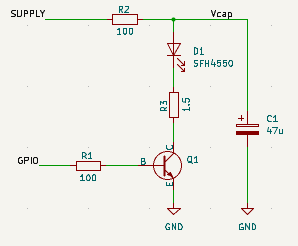
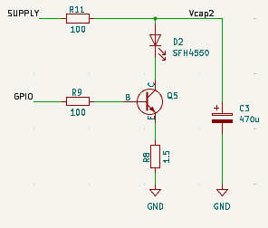

# High Current Pulses

## Rationale

There are two principal reasons you might want to deliver very high current pulses through the emitter LEDs. To be clear, by high current I mean more than 500mA - perhaps as much as 1 Amp. High current pulses are only safe when they are very short.  and have a low duty cycle. Attempting continuous drive at more than 50 - 100mA is likely to damage or destroy most LED emitters.

### Signal to Noise

Ambient illumination generates a constant current through the detector. There will always be some output even with the emitters disabled. With phototransistor detectors, there is also likely to be a change in the response gain as ambient light increases. It is generally desirable to keep the ambient light effect small. Good light shielding on the detector will help a lot. 

If the signal generated as a result of the emitter pulse is much larger than this ambient signal, then you can say that the signal-to-noise ratio (SNR) is high. The aim then is to use the largest emitter pulses you can in order to maximise SNR. However, the nature of reflective sensors is that the irradiance provided by the emitter decreases in an inverse square relationship. This assumes that the emitter has a narrow beam width and acts like a point source which is often true for practical micromouse sensors. If you use a larger current for better detection at distance, the response when close to a wall may well saturate. To an extent the sensor geometry can be adjusted to help mitigate these effects, but often at the expense of linearity.

Normally, the output of an LED increases linearly with current but only up to a point. At higher currents, the efficiency drops and output is reduced.

### Detector Sensitivity

Reducing the detector sensitivity, coupled with stronger LED pulses, can improve the SNR as already mentioned. This is normally achieved by reducing the load resistor in a phototransistor detector. 

Photodiode detectors have a much smaller response to illumination. Often only $1/100$ that of a phototransistor. They are sometimes chosen because their response is faster and much more linear over a wide range of ambient illumination levels. Even at high ambient levels, the response gain remains very similar to that at low levels. However, a photodiode detector can still saturate if ambient illumination produces a large proportion of the available supply voltage, or if the emitter pulse generates a response that is similarly too large.

Photodiodes are usually reverse‑biased to keep their junction capacitance low and maintain linearity; without this bias, their response slows and becomes less predictable.

### Detector Wavelength

Another reason your detector may have reduced sensitivity is a mismatch in the spectral response between emitter and detector. Infra Red Emitters usually operate at about 850nm or 950nm. There are some in between and some with longer wavelengths. For best result, you would want to find a detector with its maximum sensitivity close to that of the emitter. Not only will that maximise the response due to your emitter pulses, it will also reduce the response to ambient illumination at other wavelengths. That is not always possible though. If you want to use visible red emitters, the light will probably have a wavelength around 650nm and there are fewer choices with good response at that wavelength. There are suitable devices though if you search about.

Carefully examine the datasheet of any detectors you intend to use. In particular, if using visible light detectors look out for those that, like the SFH313FA and TEFT4300, have visible light blocking packages specifically designed to exclude light with wavelengths much below 800nm

Comparing the datasheets for the [TEFT4300](https://www.vishay.com/docs/81549/teft4300.pdf) and [SFH313FA](https://look.ams-osram.com/m/5f84917e436bcd12/original/SFH-313-FA.pdf), you would also see that the SFH313FA response is good at 850nm but down to 60% at 950nm. The TEFT4300 though has a peak at around 940nm and almost no response at 850nm.

Find out more about detector devices on the [Wall Sensor Detector](./wall-sensor-detectors.md) page.

## Delivering the current

So, you have decided to use a relatively insensitive detector like a photodiode, you are going to need big current pulses through the emitters. A good choice might be the SFH4550, rated at 1 Amp for short pulses. When you absolutely, positively got to illuminate every photodiode in the room, accept no substitutes.

It may turn out easier than you think to get a good high current response from an LED in a micromouse-style robot if you are prepared to accept some trade-offs.  There are several main constraints:

- Supply Voltage
  
    As in all the examples, the available headroom is a major consideration. After adding up all the various voltages across a sense resistor, the switching device, and the LED,  will the average voltage on the storage capacitor be high enough to allow the required current to flow.

- Pulse stability
  
     If the current pulse droops rapidly, even if it reaches the desired initial current, the amount of light available for the detector by the time you get around to measuring it may be somewhat less than expected. If, for example, the current had drooped from 1000mA to 800mA in that period, you might have been better off designing for a stable 800mA pulse in the first place. That would give a higher average supply voltage, lower average current and potentially less noise in the power supply.

- Battery Capacity
  
    Frequent pulses at 1 Amp can discharge small batteries faster than you might like. Assuming a short pulse of just 10$\mu$s for four sensors every millisecond would represent an average current of 40mA. If you use pulses of 40$\mu$s, that will rise to 160mA. The short pulses are manageable, the longer ones may not be.

- Circuit Design

    High current pulses flowing around a practical circuit bring their own concerns. If the current is coming from a storage capacitor, it needs to have a low equivalent series resistance (ESR) to avoid losses or excessive power dissipation. Resistors expected to pass large currents must be physically sized to ensure they operate within power limits. Transistors and LEDs may only be able to operate at high current with very short pulses and low duty cycles. Even very short pulses can cause damage if the temperature rises too far. Check the datasheets carefully. The PCB wiring must be able to handle the required current and routing of traces should be carefully considered to minimise interference with other parts of the circuit. Induced current spikes can upset the detectors and the losses in both power traces  and ground returns may affect things like ADC references.

### An Example

Suppose you want a 1 Amp pulse through a SFH4550 for just 10$\mu s$ every millisecond. For your first attempt, you try the basic switched control with a BC337 and a small current limit resistor:

/// caption
High Current Switched Bipolar
///

According to its datasheet, the BC337-40 can only sustain a continuous current of 800mA but no limit is given for current pulses. As has been common in all the examples, the limits are often about power dissipation and it should be safe enough to send short pulses of 1 Amp or more through the transistor if it is in saturation.

The datasheet also indicates that the transistor gain ($\beta$) is still as high as 50 at these currents. That means 20mA is needed into the base for a 1000mA pulse. The base-emitter voltage will be on the high side with 20mA flowing into the base but there is no clear data for what it will be. Take a pessimistic value of 1.0 Volts. With $V_{IO} = 3.3 V$ at the gPIO output, there is just enough voltage across the base resistor, R1, to supply the current needed.

So far so good but what about the supply voltage?

$V_{cap}$ is going to be less than the supply voltage because of the average current through the protection resistor R2. That will drop something like 4 Volts with an average current of 40mA. During a pulse, the current limit resistor R3 will drop 1.5 Volts because of the 1 Amp passing through it. The transistor datasheet indicates that $V_{CE(sat)}$ might be as high as 0.7 Volts - it is likely to be less than that in practice though.

Altogether then, there is a possible $4.0 + 1.5 + 0.7 = 6.2 V$ lost in the circuit before the LED voltage drop is even considered. Clearly, the circuit is not going to operate as designed from a 5 Volt supply. 

Somewhat annoyingly though, it will operate although at a significantly lower pulse current.  If you were to build this circuit, you would get a response from the detectors and it might well be quite large. It would not, however, be what you wanted in the specification. Not only would the peak current be smaller, it would tail off quite rapidly because the storage capacitor, C1, cannot hold enough charge. The circuit would appear to operate but it would be badly out of specification. Most likely, the peak current would stabilise at some lower value where the sum of the various losses, plus the LED forward voltage add up to the available $V_{cap}$ which would actually be a little higher than expected because of the reduced load from the LED.

To get a better pulse shape, you can simply increase the value of the storage capacitor. Make C1 470$\mu$F and you will get more stable pulses at the small expense of a longer start-up time while the system reaches equilibrium. With the larger capacitor, it might be 250ms before the available voltage becomes stable so you would have to factor in that delay whenever the emitters are re-enabled. The time constant for 100 Ohms and 470$\mu$F is 47ms and it will take 3 time constants to get within 95% of equilibrium, 5 time constants to get within 99%.

Substituting a logic-level MOSFET in here would not significantly change the behaviour - there is simply not enough headroom available in a 5 Volt supply to get the desired pulse current.

Overall, the goal has not been met so how can improvements be made?

### Improved Example

The circuit cannot meet its design goals simply because there is not enough voltage headroom. The most obvious solution is to use the battery voltage to drive the emitters. That, however, is not stable and so some kind of current regulation is needed. This has been discussed in the [Basic Constant Current](./basic-constant-current-drive.md) page so let's see if that can achieve the goal. All of the concerns about over-driving devices, average current and voltage drops  are still just as relevant as in the previous section. 

As with the other regulator circuits, the simplest change is to move the current limit resistor to the emitter to make an emitter-follower. All the values remain the same except that now, the supply voltage will be 7 Volts or more most of the time.

Here is the circuit:

/// caption
High Current Bipolar Current Regulation
///

So long as the transistor has sufficient gain, the circuit will successfully regulate the pulse current for the short 10$\mu s$ pulses for any supply voltage of 7 Volts or more.

Take a closer look at what is happening at the transistor base though. With a 1 Amp pulse, the emitter voltage will be about 1.5 Volts and the base voltage may be between 0.7 and 1.0 Volts higher, depending on the transistor gain. With $V_{IO}$ at only 3.3 Volts, and $V_{BE}$ at 0.7 Volts, the base would sit at 2.2 Volts so the maximum likely base current will be only $(3.3 - 2.2)/100 = 11mA$. The processor will have no problem delivering that current but the transistor gain will need to be at least 100 @ 1Amp if you are to get the required current. In this particular case, the BC337-40 is the highest gain variant for that transistor and, although should be capable of performing as designed, it is not guaranteed. Even within the same part number, gain varies widely between devices and falls sharply at high currents, so some units may regulate better than others.

If a logic level MOSFET is used in source-follower mode to replace the BC337, it will have to be able to pass 1 Amp with a gate-to-source voltage of just $3.3 - 1.5 = 1.8$ Volts. The DMG2302UK should be able to achieve that. Take care though: As mentioned elsewhere, the relationship between $I_D$ and $V_{GS}$ is not sharply defined and the final regulated current is likely to be an adjust-on-test matter that may be different from one example to another.

Both types of transistor should work but may be at the margins of reliability for this circuit. Look at the sections on op-amp feedback in the [Advanced Constant Current](./better-current-regulation.md/#op-amp-feedback-for-the-mosfet) page for a more robust and repeatable solution.

### Why This Design Is Marginal

Even though the regulated emitter‑follower version *can* deliver short 1 A pulses, it operates very close to several practical limits:

#### - Limited Base‑Drive Margin
With the emitter at ~1.5 V during a 1 A pulse and the base at ~2.2–2.5 V, a 3.3 V GPIO pin can only supply around 10–12 mA of base current.  
At 1 A collector current, this requires a transistor gain of **80–100**, which is achievable but not guaranteed across all devices, temperatures, or batches.

#### - Gain Falls at High Current
Bipolar transistor gain typically **drops sharply** at high collector currents.  
A BC337‑40 may meet the requirement, but another unit from the same reel may not.  
This makes the design sensitive to device variation.

#### - Tight Voltage‑Headroom Budget
The LED forward voltage, sense‑resistor drop, and transistor $V_{BE}$ all consume headroom.  
Any droop in the supply or storage capacitor reduces the available $V_{CE}$, pushing the transistor out of regulation.

#### - MOSFETs Don’t Escape the Headroom Problem
A MOSFET in source‑follower mode loses $V_{GS}$ as the sense‑resistor voltage rises.  
With only 3.3 V of gate drive, many devices cannot reach a low enough $R_{DS}$ to sustain 1 A.

#### - Thermal and Pulse‑Rating Limits
At 1 A, even 10 µs pulses stress both the LED and the transistor.  
Safe operation depends on pulse width, duty cycle, and junction temperature — all of which leave little margin.

---

**In short:** this circuit *can* work, but only if everything goes right — high‑gain transistor, strong supply, low wiring losses, and carefully chosen components. For a more robust and repeatable design, the advanced constant‑current drivers are a better choice.
