# Basic Software Methods

The basic micromouse wall sensor determines the distance to nearby walls by measuring the amount of light reflected from them when illuminated by an LED. We need a way to account for any additional light falling on the walls and isolate only the signal caused by robot's LED. 

In principle it is very easy to do with two separate measurements. One measurement is taken with the emitter off (the 'dark' reading, $A_{dark}$) and then another is taken with the emitter on (the 'lit' reading , $A_{lit}$). Now the raw distance reading , $A_{raw}$, is just the difference between them

$$
A_{raw} = A_{lit} - A_{dark}
$$

The first reading captures the ambient light and the second captures the ambient light plus the reflected light. Subtracting one from the other will remove the effect of the ambient light.

In a perfect world, $A_{raw}$ would be a single, stable number related to the distance to the wall. 

## Noise Measurement

Inevitably, any measurement system will have some noise. Noise, for our purposes, is any variation in the measurement that is not caused by the wall distance. Some possible sources of that noise have already been listed. An experiment will let us see how significant that might be in a basic micromouse wall sensor.

For simple experiments, a circuit is built on a breadboard so that some of these effects can be examined. A processor module carries the STM32U575 processor, a constant-current source provides the drive for an emitter LED and a phototransistor detector has a load resistor to ground, providing a voltage proportional to the photocurrent. The emitter is a SFH4550 with 100mA pulses and the detector is a SFH309-FA. The -FA suffix indicates that the part has a filter that blocks visible light.

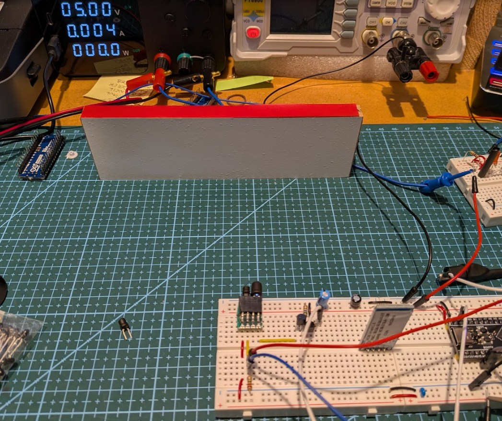
/// caption
Sensor Test Rig
///

The system operates the sensor exactly as it might on a micromouse. The emitter pulses are 25us long to allow the detector to reach a steady state, and the ADC is sampled before and at the end of the emitter pulse. The dark and lit readings are then printed out to the serial port followed by the raw value and a filtered version of the raw value. Four numbers altogether.

A Python script reads these numbers and draws a live-updating frequency histogram for each. In the charts below, the x-axis is ADC counts and the converter has a 16 bit resolution. Each count then is worth just 0.2mV and the minor grid lines are 20 counts (4mV) apart. To keep things visible on one chart, the wall is placed 70mm away and the detector load adjusted to give readings in a useable range.

Here is a typical chart produced after collecting 50,000 samples when the room is lit by daylight and a very small amount of weak sunlight on a wall 4m away. A large number of samples lets us see a statistically meaningful distribution.

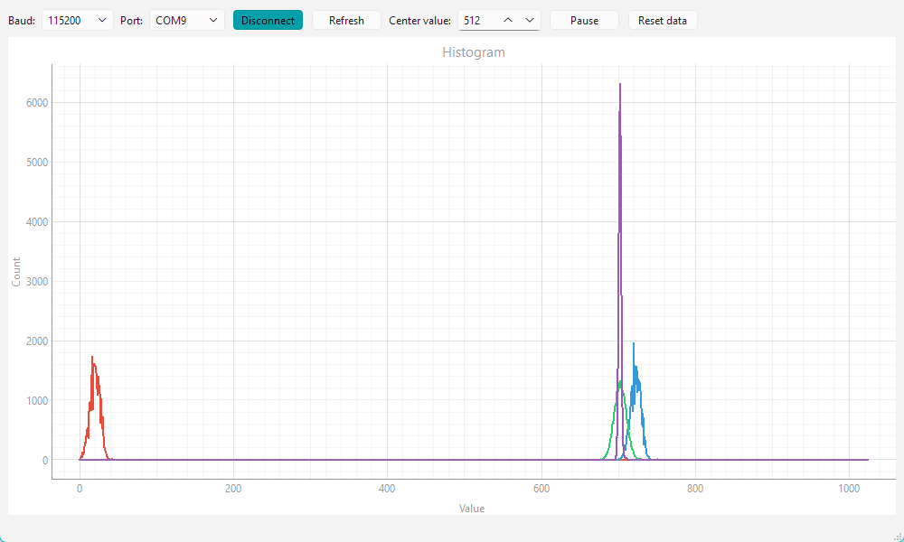
/// caption
Typical Histogram Plot
///

There are four lines on the chart, drawn one over another so you may not always see them all in other plots.

- Red: the dark reading $A_{dark}$
- Blue: the lit reading $A_{lit}$
- Green: the raw reading $A_{raw}$
- Magenta: the filtered raw reading $A_{filt}$

The background illumination (red) is not very strong and shows a fair amount of spread. This spread represents noise. Note that the area under each line is the same - it is the total number of samples. A signal with a lot of noise will display as a lower, wider plot and a signal with very little noise will be taller and narrower. Here, both the dark and lit (blue) readings produce much the same shape plots with the lit readings shifted right by an amount proportional to the amount of light from the emitter that is reflected by the wall.

As described before, the raw reading (green) is just the lit reading minus the dark reading. Also plotted on the chart is a filtered copy (magenta) of the raw reading. A simple low-pass filter is applied to the raw reading to get a very clean, estimate of distance. The filtering is defined in a separate page.

If the only light falling on the wall when the emitter is off is that from the environment then you might wonder why there is so much apparent noise (the wide spread of values). After all, the sunlight will only vary slowly as clouds pass in front of it.

### Noise Baseline

To get an idea of how well the processor and its ADC are working, we start by connecting the ADC input to a nearby low impedance voltage divider made with 4700 Ohm and 220 Ohm resistors to give a constant voltage of about 190mV, and recording the results for a minute or two:

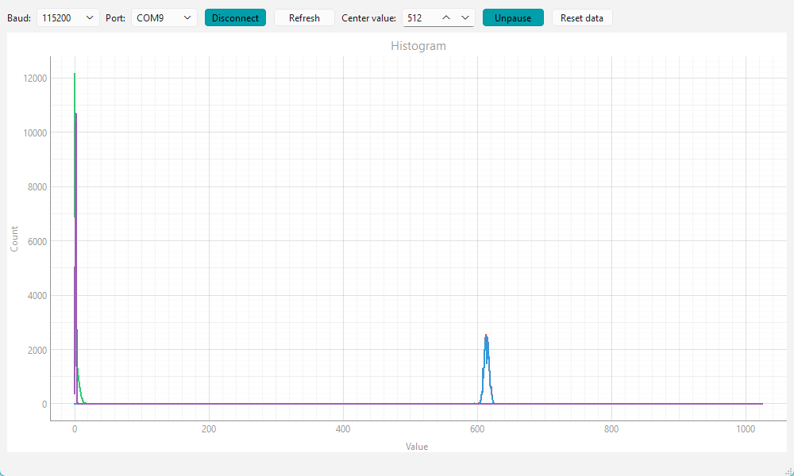
/// caption
Noise Baseline
///

In this chart you can see that the lit and dark readings are nearly identical (there is only the tiniest hint of the dark readings peeping out behind the lit readings), so the raw and filtered readings are (pretty much) zero. There is obviously some noise as evidenced by the spread in the lit and dark readings. This appears to be purely random (Gaussian) noise. Because this noise is not identical for the lit and dark values there is also some small spread in the raw value.

Because the lit and dark readings have the same underlying value, subtracting them removes the common part of the signal - that would be the ambient illumination and any other constant offset voltage. The noise itself doesn’t cancel - it adds - but since the mean is zero, the result is a narrow, high peak.

Another important observation is that the lit and dark values have almost identical averages. That tells us that switching the emitter on and off is not disturbing the processor or the ADC in any measurable way.

### Basic Range Measurement

Now we have some idea about the noise that appears to be intrinsic to the measurement system, and we are confident that the emitter pulses are not causing any side effects in the detected signal.

The next step is to connect the ADC input to the detector and perform a measurement against a fixed wall. The ambient illumination in this plot is diffuse daylight in a not-very-well-lit room.

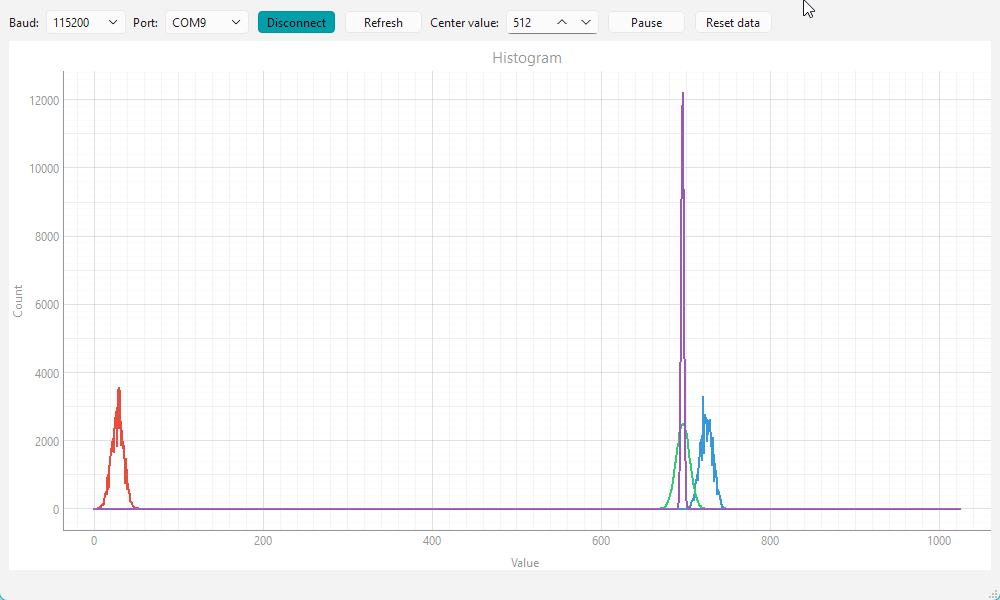
/// caption
Diffuse Daylight Response
///

The low level of ambient illumination is clear and the noise component, as evidenced by the spread, is a little bigger. Part of that spread will be due to the effect of clouds passing by and changing the overall amount of light in the room. Even taking that into account, there is still more random noise in these signals. The most likely reason for that is the circuit construction on breadboard being less than ideal.

Normally, I work on this at night with only the LED room lighting available so that I can guarantee reproducible results. This is the same experiment with only artificial LED lighting:

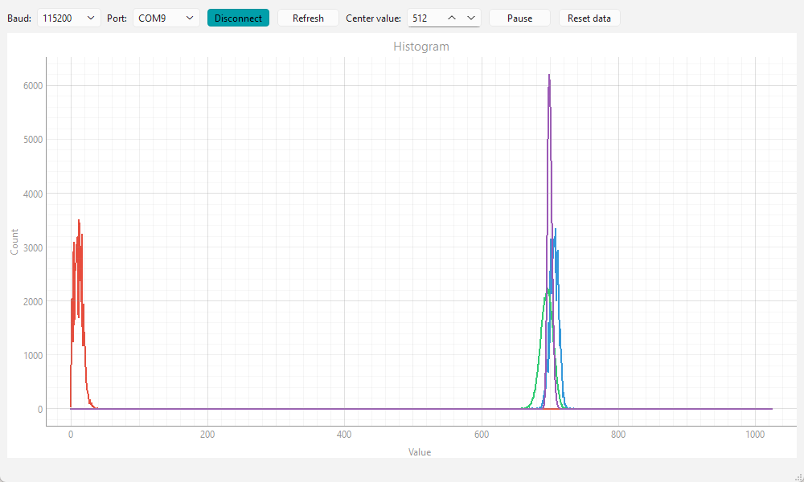
/// caption
Record with LED lighting
///

You should notice that the raw reading still has a similar variance to that seen in the lit value but the shape is much cleaner. Any external or other noise that does not change much between sample intervals (25us) will be cancelled out by the raw reading calculation. The filtered raw values (magenta) are very clean as you might expect.

All the remaining experiments are run under the same artificial light.

The ambient illumination can be increased significantly by lighting the rig with a LED table lamp about 15cm from the wall surface. 

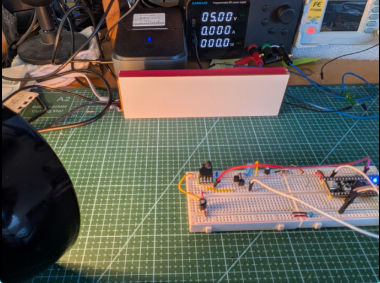
/// caption
Brighter LED Illumination
///

When the run is repeated under these conditions, this is the result.

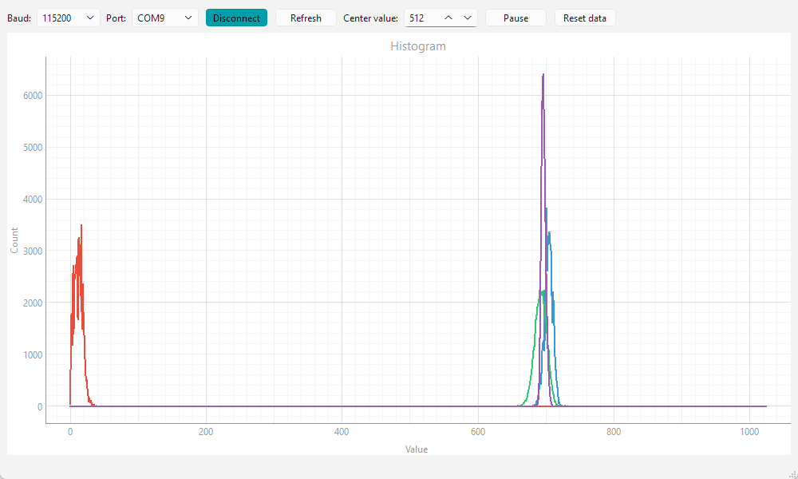
/// caption
Record with Bright LED lighting
///

This result is almost indistinguishable from the previous experiment, and demonstrates the effectiveness of the visible light filtering on the SFH309-FA.

### Steady IR illumination

Modern LED interior lighting clearly produces little IR radiation and so it can be easy to underestimate the effect of sunlight and other lighting types that do emit IR. It would be very optimistic to expect a sensor like this to operate reliably in direct sunlight but there may be indirect, or partially occluded, sunlight falling on the walls of a contest maze. An easy way to simulate this is with an old-fashioned, battery-powered flashlight containing an incandescent bulb. 

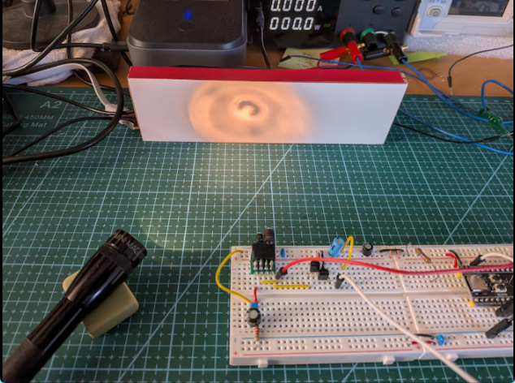
/// caption
Simulating daylight with a flashlight
///

The wall is illuminated in this way and another run is made.

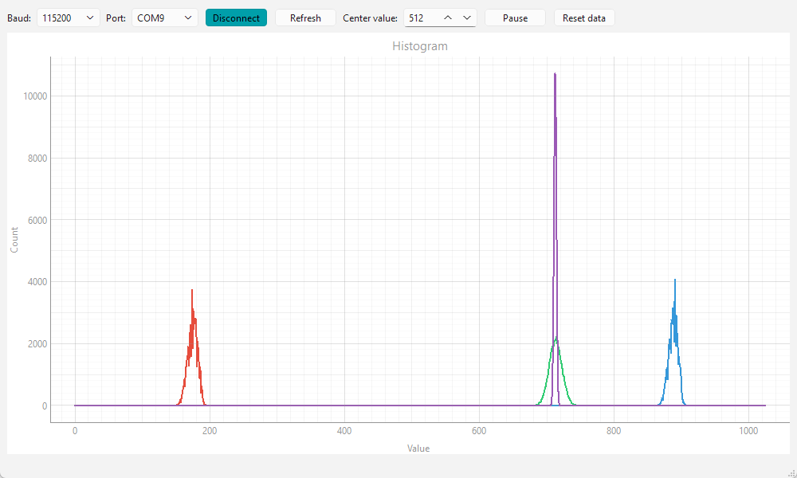
/// caption
Record with IR illumination from a flashlight.
///

The flashlight produces a almost constant level of illumination and the effect of that is very clear from the result chart. The results look a lot like those recorded with only natural daylight available. With the flashlight dominating the readings, even when the emitter is off, the noise variance returns to the intrinsic measurement noise level seen earlier. Remember that one minor division on these charts is only about 4mV variation in the reading. The dark readings are all clustered around about the 180 mark and the lit readings are also shifted up by the same amount. Since both the dark and the lit readings have been shifted by the same amount, the raw reading, being the difference between them remains almost exactly the same. Close inspection reveals it to be slightly higher than before because, with this type of sensor, there is a small change in gain with the level of illumination. For this particular example, the change is about 1.5% and the level of IR illumination at the wall is quite significant.

### Variable IR illumination

Suppose now that the contest illumination is not LEDs but some other type that does emit significant IR. Incandescent bulbs are very rare now but may still be present in older venues or houses. These types of bulb actually flash on and off at 100Hz as the 50Hz AC mains flows back and forth through the filament, producing light pulses in each half cycle. Now let's use a small (15W) incandescent bulb in a table lamp about 20cm away from the wall in an attempt to get similar average levels of illumination as those seen with the flashlight.

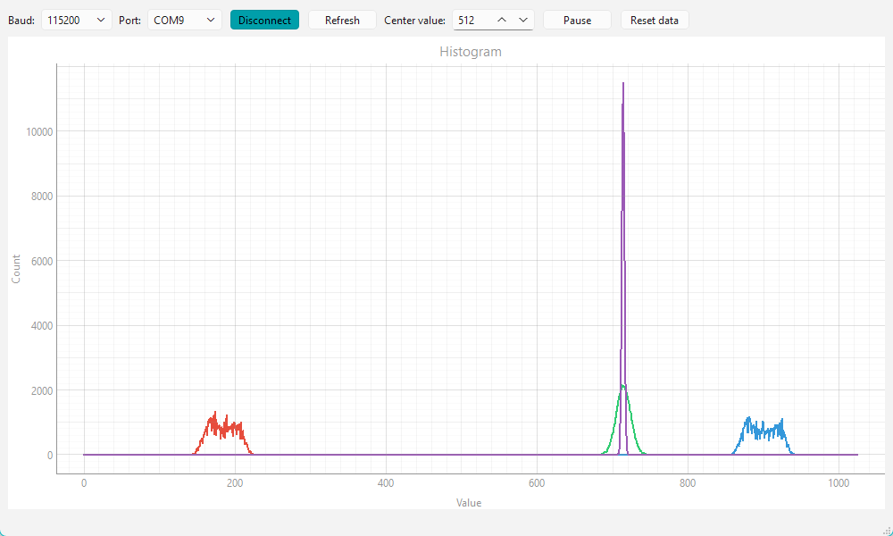
/// caption
Record with IR illumination from an incandescent bulb.
///

Notice how both the dark and lit responses are much more spread out. Each has two peaks because more samples correspond to the brighter portions of each cycle than the darker portions that correspond to the current through the lamp passing through zero. The filament does not cool down enough to stop glowing, it just puts out a little less light.

In spite of that spreading, the raw value response is very clean and looks exactly like that for the steady IR illumination from the flashlight. Although the table lamp is clearly varying a lot in intensity, those changes are very slow compared to the 25us interval between readings that the sensors can manage. Overall, ambient cancellation only works if the ambient illumination changes slowly compared to the measurement interval.

Because the ambient does change only slowly, the dark and lit readings experience almost the same ambient level and so the subtraction cancels it.

### Visible Light Sensors

Some builders prefer to use a detector that does not have a visible light filter. These can be more sensitive and are essential if a visible light emitter is used. For comparison then, the sensor in the test rig was replaced with a BPW85C. The load resistor is reduced to just 220 Ohms because of the increased sensitivity of this phototransistor. The emitter device current remains as before.

Repeating the basic run with only the room's LED ambient light immediately reveals that the phototransistor has a noticeable response to visible light.

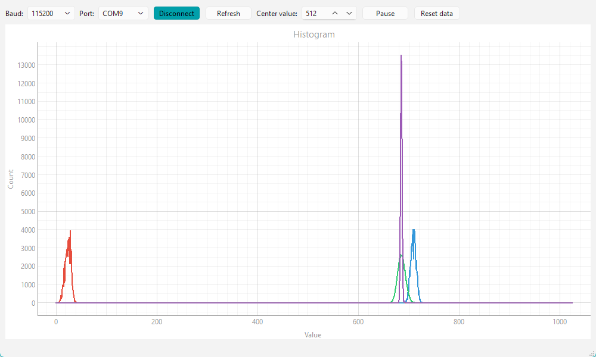
/// caption
Record with LED room lighting and the BPW85C detector.
///

The measurement noise, as indicated by the width of the response, is still the same but the dark reading's average value is distinctly greater.

Now see what happens with the incandescent lamp:

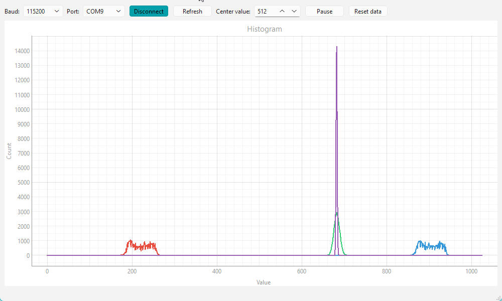
/// caption
Record with incandescent lighting and the BPW85C detector.
///

To get a similar response to the SFH309-FA experiment, the lamp had to be moved back to 36cm, demonstrating how much more the BPW85 is susceptible to ambient interference. without the filter, it is able to respond to a much wider range of wavelengths and they are all being emitted by the incandescent bulb. You should notice that the responses are wider again but that the raw and filtered responses are just as clean as they were before.

### Dimmable Lighting

It is worth noting that some types of artificial lighting may contain significant artifacts from the way they operate. Most modern LED lights are likely to have a constant illumination. However, some types may flash on and off at the mains frequency. The variation in light output for these will be much greater than that of incandescent bulbs as the LEDs turn fully on and off at twice the mains frequency. This is most likely for dimmable types. Some dimmable and colour changing lights may use much higher frequencies to operate their Pulse Width Modulation schemes. A 1kHz frequency is an easy choice for the designer of both room lighting and micromouse circuits and there is a lot of potential for interference.

## Summary

It should be clear that the ambient cancellation technique is very good at reducing, or eliminating the effects of ambient illumination (process noise) but it cannot eliminate measurement noise that is an intrinsic part of the sensor system. Nor can it compensate for changes in the operating point of a phototransistor as the ambient illumination changes. However, the measurement noise can be significantly reduced by filtering so long as we are prepared to accept a delay in the response.
