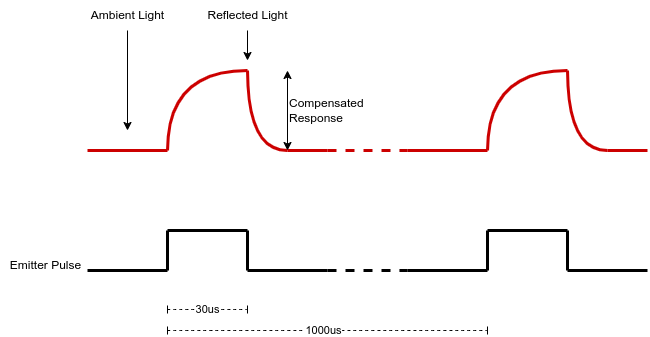

---
# 1. FRONT MATTER (REQUIRED)
# The MkDocs title is automatically used for the navigation and the page heading.
# title: Template
subtitle: 
description:
# icon: octicons/dot-fill-16
# icon: octicons/dot-16
# icon: octicons/dash-16
# icon: octicons/chevron-right-12
status:
---

# Wall Sensor Emitter Types

The emitter half of the wall sensor will shine a strong light onto the walls, usually from one or more LEDs. These can be visible types that are most likely to be red. Typical devices, like the TLCR5800, are very bright and throw a narrow beam. More common in high-end micromouse robots is an invisible Infra Red LED like the SFH4550. This kind of LED emits a lot of IR light in a very narrow beam. If you could see the IR, the result would look a lot like the high brightness red type. However, because you cannot see IR, it can be difficult to properly align the emitter to have it point exactly where you want it.

#### Safety
Note that IR emitters used in micromouse sensor can produce a lot of energy. The eye has no blink reflex associated with IR light. While you might blink and reduce the effect of a bright red LED, a bright IR LED can damage the retina without you being aware. 

!!! danger "Safety with IR emitters"

    Never look into IR emitters. The light is invisible and can cause permanent damage.

Datasheets for the two devices used in this guide are available here:

- [TLCR5800 Ultrabright Red LED](https://www.vishay.com/docs/83178/tlcr5800.pdf){target="_blank"}
- [SFH4550 Infra Red Emitter](https://look.ams-osram.com/m/7d214b223a9adb85/original/SFH-4550.pdf){target = "_blank"}

## Operating Mode

It is impractical to constantly drive an LED at a high enough brightness for it to be effective as a wall sensor. Not only would it be very wasteful of the available battery power, the LEDs will soon be destroyed by the heat built up.

In almost all cases, the emitters will be pulsed on and off. Generally, the scheme is to measure the ambient light, light up the LED and then measure the reflected light. The difference between the two reading will then be dependent upon the walls and the effect of ambient light will be reduced - ideally to zero. Finally, the LED is turned off until the next cycle.

By making the light pulses extra bright, they will dominate the response and a less sensitive detector can be used. Having a less sensitive detector makes it easier to eliminate the effect of high ambient illumination. To get the extra light out of the LED, you will want to put a current through it which is significantly larger than the normal, safe maximum continuous current specified in the datasheet. The datasheet will normally include an indication of the maximum permitted pulse current along with an associated duty cycle. That aim is to limit the average power dissipation in the device.

The length of each pulse and the repetition frequency will vary according to your design requirements. The LED must stay lit long enough for the detector to respond and the ADC converter to take a measurement. Modern processors are often able to complete a conversion in 1 microsecond but practical constraints may lengthen that time. If the detector is a phototransistor, or if it uses an amplifier, it may take a few tens of microseconds to fully respond. In this guide, it is assumed that a pulse of 25-50 $\mu$s is required.

Usually the measurements are repeated once per control cycle. That may be 500Hz or 1kHz. Some users sample multiple times per control cycle, others have control cycles with higher frequencies.

/// caption 
Principal of Operation
///

## Driving the Emitter LED

So, you need to pulse the LED on and off at regular intervals and provide quite large currents when the LED is on. Larger currents than would normally be safe.

There are several ways you can drive the LED. In terms of the triggering signal, that is going to be all about providing logic pulses on a GPIO pin. Mostly that is a software concern but you need to be aware of some of the characteristics of the GPIO device.

 - Voltage Available:
  
    Normally, the GPIO pins on a processor switch between 0 Volts and the processor supply voltage which may be 3.3V or 5.0V. A processor with 5V outputs can have the voltage reduced fairly easily but a 3.3V processor has more trouble increasing the output voltage. Be sure that the emitter control circuit will work reliably at the available GPIO voltage.

 - Switching Speed:

    Some processors allow you to change the amount of drive available to a GPIO pin. This could be described as setting the 'speed' of the pin. What it really does is make  it possible to deliver higher currents which may be needed to turn external devices on or off more quickly. The option is available to make it easier to reduce the total power consumption of the processor. With no load, the GPIO output is always going to switch very quickly. Think nanoseconds rather than microseconds.

 - Current Available:

    Depending on the type of emitter controller you use, it might be necessary to provide quite large currents from the GPIO pins. A MOSFET draws almost no current while operating but may need a surprisingly large current spike when it is turned on or off. Bipolar transistors can require significant currents, even when used as switches. A single bipolar transistor with a gain of 50 will need at least 10mA into the base to keep it turned hard on in a switching configuration to supply 500mA through a LED. Processor GPIO pins have upper limits on the available current and this is likely to be in the range 10mA to 20mA. Some can manage less than that. You may have to increase the drive current in software to get the most from the pin. It is also quite possible that the default pin configuration in your chosen software environment is inadequate for the task.

## Emitter Control Methods

Other pages in this section look in more detail at some options for controlling the LED output

- [Basic Switching](./switched-emitter-drive.md): Uses a transistor or other device as a switch in an attempt to provide a fixed, consistent current pulse through the LED. Easy to implement, these have limitations.
- [Simple Current Control](./basic-constant-current-drive.md):  Uses a slightly more complex circuit, or specialist driver, to try and ensure that the LED current, and thus the light output, is constant over a range of operating conditions.
- [Advanced Current Control](./improved-current-regulation.md): More complex circuits can be used to improve the performance of the current regulation technique to guarantee a consistent light output for each pulse that can be varied in different circumstances.
