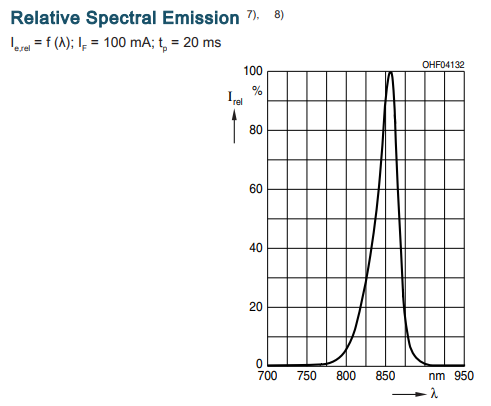
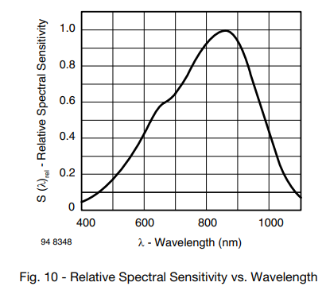
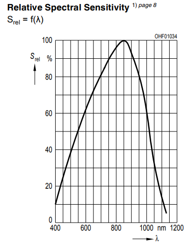
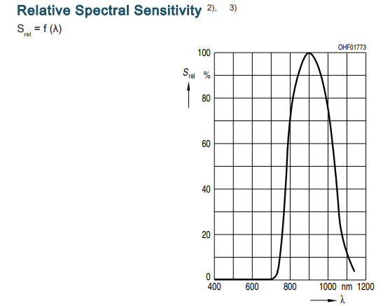
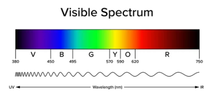

---
# 1. FRONT MATTER (REQUIRED)
# The MkDocs title is automatically used for the navigation and the page heading.
# title: Template
subtitle: 
description:
# icon: octicons/dot-fill-16
icon: octicons/dot-16
# icon: octicons/dash-16
# icon: octicons/chevron-right-12
status:
---

# Wall Sensor Filtering

Filtering is the process of suppressing, or removing, unwanted portions of a signal. The idea is to make the wanted part of a signal a greater proportion of the whole.

For wall sensors there are three fundamental types of filter:

 - **Optical Filtering** of the light that is detected
 - **Electronic filtering** of the signal generated by the detector
 - **Software filtering** of the signal read by the processor

By combining optical, electronic, and software filtering, you can produce a clean, stable signal that responds reliably to wall distance under a wide range of conditions. Software filtering can also extract additional information beyond a simple measure of distance.

## Optical Filter

If you have an LED that puts out light of predominantly one wavelength and a detector that can respond to a range of wavelength, it should be clear that the measured signal will have components that are nothing to do with the LED's light output. Those components add to the detector's signal but not to the information that it contains. An optical filter is designed to attenuate light wavelengths outside the range emitted by the LED.

Consider the SFH4550 LED. It has a peak emission at about 860nm

/// caption
SFH4550 Emission Spectrum
///

Now look at the spectral sensitivity of a couple of candidate detectors. 

/// caption
BPW85C Spectrum
///

It has a nice peak at about the same wavelength as the SFH4550 but also responds quite well to light at many other wavelength both longer and shorter.

The SFH213 photodiode has a very similar sensitivity spectrum:

/// caption
SFH213 Spectrum
///

Suppose you could find a material that was opaque to visible light but would allow the near-infrared light of the SFH4550 to pass through. Place that over the detector and the response to much of the ambient light would be attenuated - possibly by a great deal.

Finding such a material can be a bit tricky. You would want to search for "IR longpass" filters and there are various options. These are mostly photographic filters and are not cheap. A good DIY substitute can be made by fully exposing colour negative film which is then developed in the normal way. The resulting film is a good IR longpass filter. The bad news is that in these days of camera phones, traditional colour film is harder to come by. On the other hand, one 35mm film canister makes a lot of filter material.

Some phototransistors and photodiodes come in packages that have visible light filter in the package material. There is, for example the SFH213-FA which is a filtered version of the SFH213. These are pretty obvious to look at because the entire package looks black. In many cases, you can identify the part as having a filter by the -F or -FA suffix in the name. Here is the sensitivity spectrum for the SFH213-FA photodiode:

/// caption
SFH213FA Spectrum
///

The diode still has a peak at the same wavelength but all of the visible part of the spectrum has been filtered out by the device package.

In case you are not familiar with the relationship between wavelength and colour, here is a handy picture (source unknown)

/// caption
Visible Spectrum
///

### Limitations

Optical filtering is a very effective way of reducing the effect of visible ambient light. Under modern LED lighting conditions, it can almost entirely eliminate the effects of ambient light. However, it will not be effective against sunlight - even diffuse sunlight reflected from walls. Sunlight contains a very strong IR component, and even diffuse reflections can overwhelm the detector. Neither can it reduce the influence of other IR light sources that may be interfering with your sensors.

## Electronic Filtering

Deals with everything before the ADC reads the signal
Noise
Ambient
Bandwidth

## Software Filtering

Use the power of the processor to improve signal quality
Noise reduction
Ambient cancellation
Slope and Edge detection
Normalisation
Linearisation
