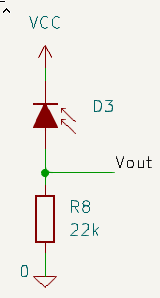
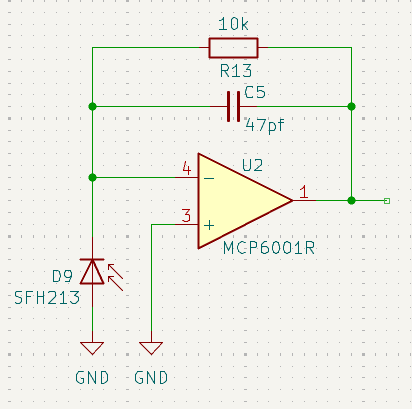

---
# 1. FRONT MATTER (REQUIRED)
# The MkDocs title is automatically used for the navigation and the page heading.
# title: Template
subtitle: 
description:
# icon: octicons/dot-fill-16
icon: octicons/dot-16
# icon: octicons/dash-16
# icon: octicons/chevron-right-12
status:
---

# Photodiode Detectors

A photodiode is a specially constructed diode with its junction exposed to incoming light.

When light reaches the junction, a small current - the photocurrent - is generated and is able to flow through any load resistor. Typical photocurrents in these sensors may be only a few tens of microamps.

The diode produces almost no current in darkness, and the photocurrent is directly proportional to the amount of light absorbed by the active region. This behaviour leads to three key characteristics:

- photocurrent is proportional to the active region area
- photocurrent is very linear with changes in incident light
- photocurrent is typically very small

The dependence on active area is worth emphasising. A larger active region increases sensitivity but requires a physically larger package. Some photodiode packages omit a lens to maximise active area. This increases photocurrent but also widens the acceptance angle, making the device more susceptible to ambient light and reducing directional selectivity.

Photodiodes have wavelength‑dependent responsivity. As with phototransistors, you should choose a photodiode whose spectral response matches the wavelength of your emitter to maximise efficiency and signal‑to‑noise performance.

## Photoconductive Mode

For sensing applications, it is often used in photoconductive mode, where the diode is reverse‑biased with the cathode connected to the supply. The photocurrent is largely independent of the junction bias and is linearly proportional to illumination. This current can be passed through a resistor to generate a voltage.

/// caption
Simple Photodiode Detector in photoconductive mode
///

Because the photocurrent is small, The load resistor must be much larger than that used with a phototransistor detector. Values in the range of 10 kΩ to 100 kΩ are common. This kind of circuit naturally has a large source impedance which can be an issue when it is used to drive an ADC input since they require low source impedances. A buffer amplifier should be used for best results.

Reverse biasing the junction decreases the junction capacitance and so speeds up the response. Photodiodes used in this mode can have response times measured in nanoseconds.

Suitable transimpedance amplifiers for use with photoconductive mode are slightly more complicated than for photovoltaic mode and, for micromouse sensors, it is almost certainly not worth the extra work. IT will be easier to use the device in photovoltaic mode.

## Photovoltaic Mode

Alternatively, the photodiode can be used in photovoltaic mode where there is no bias across the junction. The photocurrent appears as a voltage across the diode - a little like a battery. The open circuit voltage can be measured and will be proportional not to the illumination but the _logarithm_ of the illumination. Connecting a load resistor in parallel allows the photocurrent to flow through the load resistor. The voltage then measured will be somewhat lower than the open-circuit voltage across the photodiode. In this mode, the response will be smaller, and slower than in photoconductive mode. Although the speed may be significantly slower, it will still be much faster than that of a phototransistor detector. Response speed is limited by junction capacitance. Larger junction areas have higher capacitance, which increases the time constant and reduces response time. Response times can still be in the tens to hundreds of nanoseconds.

Attempting to measure the output in this way is unlikely to be reliable as the source impedance is very high.

In photovoltaic mode, the photodiode is operated with approximately zero volts across its junction. A transimpedance amplifier is commonly used to convert the photocurrent into a voltage. The op‑amp’s non‑inverting input is grounded, and the photodiode is connected with its anode at ground and its cathode at the inverting input. Although the device is operating in photovoltaic mode, it is the _current_ that is being used. The voltage across the diode remains near zero because the op‑amp, through negative feedback, forces the inverting input to match the grounded non‑inverting input. A feedback resistor connects the op‑amp output to the inverting input. Because the op‑amp input draws negligible current, all photocurrent flows through the feedback resistor. The op‑amp output adjusts as needed to maintain the inverting input at virtual ground, producing an output voltage proportional to the photocurrent. The value of the feedback resistor sets the transimpedance gain and therefore the output voltage range.

/// caption
Transimpedance Amplifier for Photovoltaic mode
///

The output voltage will now be linearly proportional to the illumination, up to the point where it is clipped by the op-amp output voltage limit. Unless the op-amp can bring its output all the way to the ground rail, the minimum output, even in the dark, will have some constant voltage.

A small capacitor is added in parallel with the feedback resistor to ensure stability at high frequencies.

This method is probably the simplest way to use a photodiode with an operational amplifier to get a positive-going voltage that is linearly proportional to illumination. The output will have a low impedance, suitable for measurement by an ADC and cannot exceed the supply voltage so should be safe for the processor pin.

Similar looking circuits can provide a reverse bias to the photodiode and operate it in photoconductive mode. Typically, they produce a negative going response to increased illumination.

## Advantages

In general, photodiodes offer two important advantages over phototransistors. 
 
 - First, they are much faster when responding to pulsed illumination. This may not matter if your ADC cannot sample at hundreds of kilohertz or more, but it can be valuable in some designs. 
 - 
 - Second, photodiodes are intrinsically more linear over a wide range of illumination levels. This means that the pulse current in very high ambient illumination is going to pretty much the same as the pulse current in very low ambient illumination. Of course, if the ambient has used up all the headroom in your circuit, that is still a problem.

