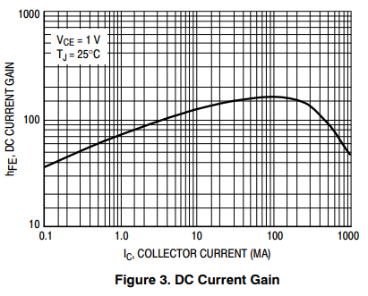
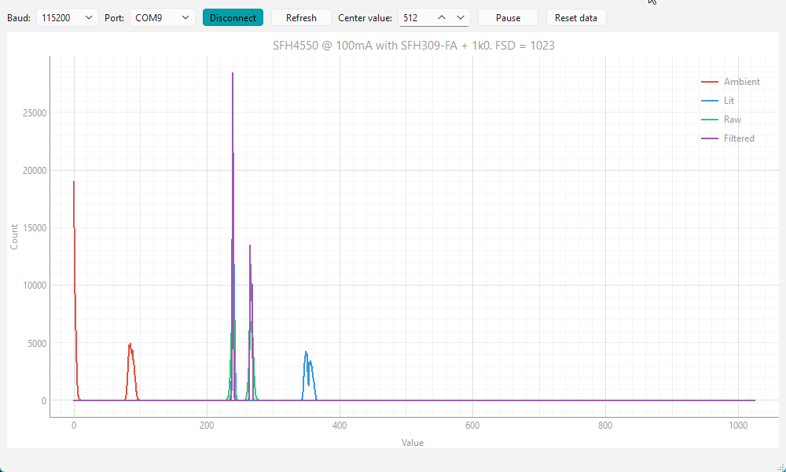
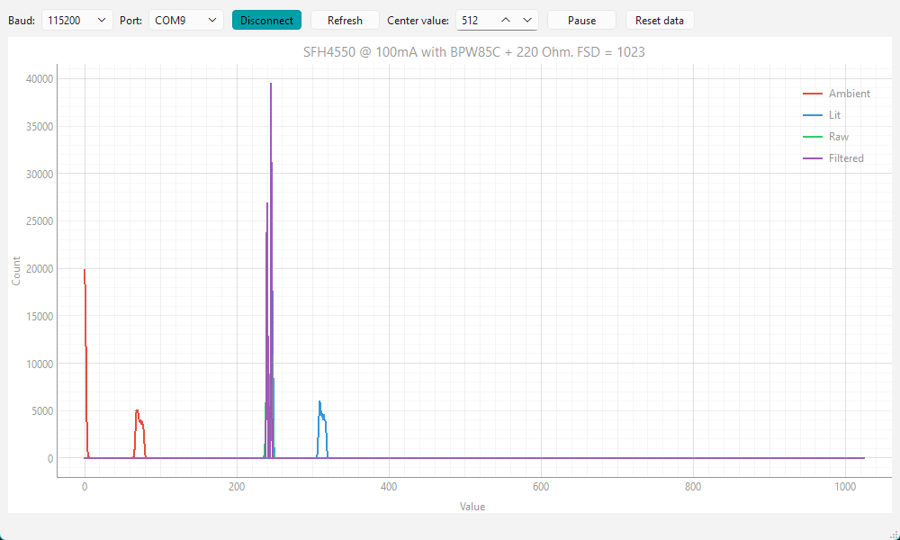

---
# 1. FRONT MATTER (REQUIRED)
# The MkDocs title is automatically used for the navigation and the page heading.
# title: Template
subtitle: 
description:
# icon: octicons/dot-fill-16
icon: octicons/dot-16
# icon: octicons/dash-16
# icon: octicons/chevron-right-12
status:
---

# Phototransistor Detectors

## Basics of Operation

A phototransistor is a specially constructed bipolar transistor that exposes the base-collector junction to the outside world. Light falling on this junction generates a small current (the photocurrent) that flows into the base as it would any other bipolar transistor. The normal transistor action amplifies the current significantly, perhaps by a factor of 100 although different devices can vary greatly in the transistor gain. By connecting a load resistor between the emitter and ground, with the collector directly connected to the positive supply, you are able to measure a voltage at the emitter that is approximately linearly dependent on the illumination. 

/// caption
Simple Phototransistor Detector in emitter-follower mode
///

This is called an emitter-follower configuration and typical load resistor values may be between 470 Ohms and 2.2kOhm. Linearity will be compromised as the transistor becomes saturated and the gain will decrease. The available dynamic range then will be somewhat less than the available supply voltage and the gain will be greatly reduced as the voltage starts to get within about 0.5 Volts of the supply voltage and the transistor begins to saturate, reducing the gain significantly. Some care is needed in calculating a emitter resistor for a given range of operation. Also, the emitter-follower arrangement is somewhat less linear than the alternative common-emitter configuration where the load resistor is between the collector and the supply. Even so, micromouse sensors frequently use the emitter-follower circuit because it is easier to reason about more light producing a higher voltage. While common-emitter provides higher voltage gain, it inverts the signal (more light = lower voltage), which can be less intuitive for beginners to debug. Another benefit is that the output impedance of the emitter-follower is very small which makes the measurement by the controller's ADC faster.

The response of a phototransistor is slower than that of a photodiode though this is likely to be of little practical consequence in a micromouse. In a typical circuit, the response is likely to have reached its steady state value in 20$\mu$s or so. The sensor software will need to either wait for the signal to stabilise or it must arrange for ADC samples to be taken after some time interval typically set with a hardware time.

Another feature of many phototransistors is that the sensitivity will vary with $V_CE$ so that, in a typical circuit, more light means less available $V_CE$ and so lower sensitivity. This is true of pretty well all parts but is particularly prominent with the TEPT5600 visible light sensor.

## Phototransistor Gain Shift

A characteristic of phototransistors is that the gain, beta ($\beta$), is dependent upon the collector current. This is the same behaviour as will be found in any bipolar transistor but it is generally not shown in the data sheet. We can infer the behaviour from observation of results and the characteristics of a general purpose NPN transistor like the BC337. In the [BC337 datasheet](https://www.farnell.com/datasheets/1789499.pdf), figure 3 shows the relationship between DC current gain, $\beta$, and Collector current, $I_C$.

/// caption
BC337 Gain vs Collector Current
///

You can see that, at low collector currents, the gain is quite small, and that it rises to some peak at higher currents before falling off once more. This behaviour is fundamental to the physics of transistor operation. While no such graph exists for the SFH309 phototransistor used in these experiments, you can assume it has a similar shape. Phototransistors are rarely used for this type of analogue application - they are more likely to be used as switches.

While the general shape of the gain vs current graph will be similar for almost any NPN bipolar transistors, you will commonly find the curve shifted left or right, possibly by a couple of decades, depending on the transistor purpose. For example the BD249 power transistor has a gain that peaks at about 1 Amp, and the 2N2222 peaks at about 50mA. Power transistors are designed to operate at high currents, so their gain peaks at high collector currents. Small‑signal transistors are optimised for lower currents, so their gain peaks in the milliamp range.

Phototransistors will also vary, though the manufacturers do not publish the gain as a function of collector current. The BPW85C, appears to have a gain that peaks at _very_ low collector currents.

Constant ambient illumination of the sensor causes a steady DC current to flow through the phototransistor. The shape of the gain curve means very low ambient illumination levels will result in a smaller response to the same emitter pulses. Higher ambient levels increase the phototransistor current and therefore the gain. Thus, the same emitter pulse will result in a different response depending on the ambient illumination. Note that this behaviour is completely absent in a photodiode over a very wide range of currents.

### SFH309-FA

A simple experiment with the SFH309-FA phototransistor will show how significant the effect can be. We use a setup just like those already seen except that more realistic values are chosen for the phototransistor load resistor. The ADC readings are divided by 16 before use to eliminate a lot of the measurement noise, giving a full-scale response of 0-1023 counts. First, a recording is made with no appreciable ambient IR. Then, without clearing the results, a second recording is made with the wall illuminated by an incandescent flashlight.

/// caption
Effect of Increased Ambient Illumination with SFH309-FA
///

With the two recordings overlaid on the same chart, it is very clear that the brighter ambient illumination results in an increase in the measured emitter pulse strength. With no ambient illumination in the first run, the DC collector current is nearly zero. In the second run, we can estimate the collector current to still only be 0.25mA which is pretty small for a bipolar transistor. The collector current can be estimated from the sensor reading, $N$, the ADC maximum reading , 1023, the load resistor, $R_L$, and the ADC supply voltage, $V_{CC}$.:

$$
I_C = \frac{{V_{CC} \times \frac {N}{1023}}}{R_L}
$$

A secondary effect makes things even worse in that the emitter pulse increases the collector current to 1.13mA where the gain will be higher still.

To make the experiment more clear, the change in illumination has been made unusually large. It would be extraordinary if such a change were encountered during a contest. It is possible though, in some venues, for there to be a large change in illumination. You might, for instance, run tests and calibration in the evening only to find the daytime event has a lot of sunlight shining through windows brightening up the contest maze. Again, direct sunlight on the maze would break pretty well everything so that would not be a practical concern. The actual increase in this experiment was around 10%. 

### BPW85C

Also, bear in mind that a phototransistor with a response spectrum that extends to visible light, like the BPW85C, will see a greater change due to ambient illumination. Running the same experiment with the BPW85C replacing the SFH309-FA shows that the response will **reduce** rather than increase with higher levels of ambient illumination. This suggests that the BPW85C’s gain peaks at very low collector currents, so increasing ambient light pushes it past its optimal operating point. The magnitude of the effect is less but notable because it is the opposite of that already observed.

/// caption
Effect of Increased Ambient Illumination with BPW85C
///

In this chart, the higher raw peak is with no ambient illumination. The variation with ambient is much smaller. In spite of the wider spectral response, the BPW85C may be a better choice than the SFH309-FA in this application.

### Observations

I have no way to determine how the experimental level of illumination mimics the actual level that might be found in a live contest but before you throw up your hands in despair, be aware of a few important observations:

 - At a working distance of 40mm, 10% is just 4mm. It is very likely that having the robot offset by up to 4mm should not prove fatal.
 - Allowing the response to get too high  runs the risk of the phototransistor going into saturation. Even without reaching saturation, increased ambient current reduces the collector‑emitter voltage, which can further reduce the small‑signal gain.
 - At longer ranges, such as when detecting a wall in the cell ahead, the effect is much smaller because the ambient illumination is a smaller component of the reflected signal
 - The walls in a typical maze can be observed to have as much as 10% variation in reflectivity in any case.
 - A change in angle of only a couple of degrees will produce much larger changes.
 - Nobody seems to have any trouble operating reliably with sensors behaving like this. So long as the response is monotonic and the behaviour around the operating point does not change wildly, everything will be fine.

If there is a key takeaway from this experiment and its results, it is that you should always try to do sensor calibration in the actual contest maze and not rely only on calibrations performed at home under ideal conditions. Conditions at home are unlikely to match those in the contest. 