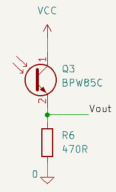

---
# 1. FRONT MATTER (REQUIRED)
# The MkDocs title is automatically used for the navigation and the page heading.
# title: Template
subtitle: 
description:
# icon: octicons/dot-fill-16
icon: octicons/dot-16
# icon: octicons/dash-16
# icon: octicons/chevron-right-12
status:
---

# Phototransistor Detectors

A phototransistor is a specially constructed bipolar transistor that exposes the base-collector junction to the outside world. Light falling on this junction generates a small current (the photocurrent) that flows into the base as it would any other bipolar transistor. The normal transistor action amplifies the current significantly, perhaps by a factor of 100 although different devices can vary greatly in the transistor gain. By connecting a load resistor between the emitter and ground, with the collector directly connected to the positive supply, you are able to measure a voltage at the emitter that is approximately linearly dependent on the illumination. 

/// caption
Simple Phototransistor Detector in emitter-follower mode
///

This is called an emitter-follower configuration and typical load resistor values may be between 470 Ohms and 2.2kOhm. Linearity will be compromised as the transistor becomes saturated and the gain will decrease. The available dynamic range then will be somewhat less than the available supply voltage and the gain will be greatly reduced as the voltage starts to get within about 0.5 Volts of the supply voltage and the transistor begins to saturate, reducing the gain significantly. Some care is needed in calculating a emitter resistor for a given range of operation. Also, the emitter-follower arrangement is somewhat less linear than the alternative common-emitter configuration where the load resistor is between the collector and the supply. Even so, micromouse sensors frequently use the emitter-follower circuit because it is easier to reason about more light producing a higher voltage. Another benefit is that the output impedance of the emitter-follower is very small which makes the measurement by the controller's ADC faster.

The response of a phototransistor is slower than that of a photodiode though this is likely to be of little practical consequence in a micromouse. In a typical circuit, the response is likely to have reached its steady state value in 20$\mu$s or so.

Another feature of many phototransistors is that the sensitivity will vary with $V_CE$ so that, in a typical circuit, more light means less available $V_CE$ and so lower sensitivity. This is true of pretty well all parts but is particularly prominent with the TEPT5600 visible light sensor.

